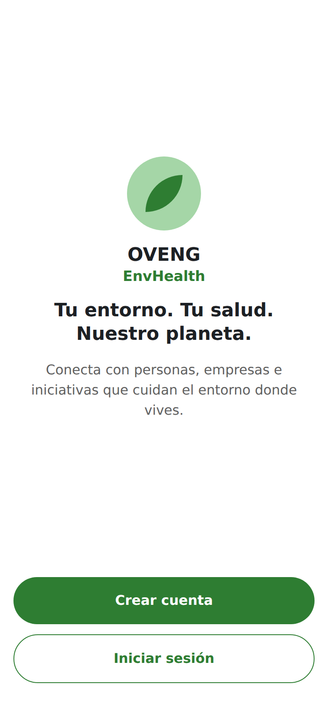
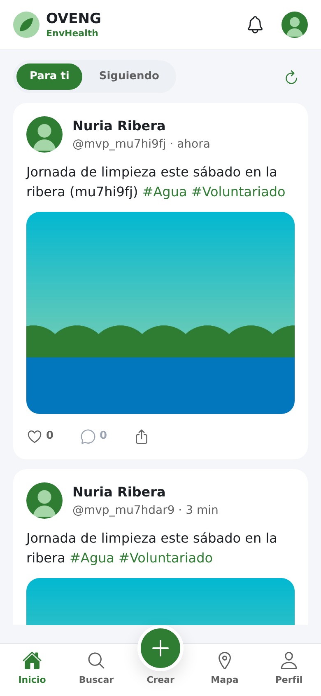
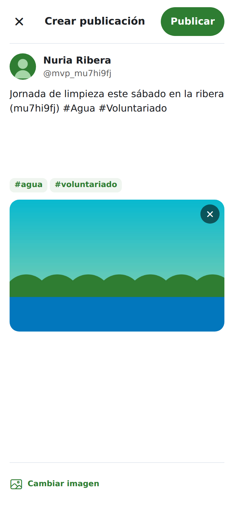
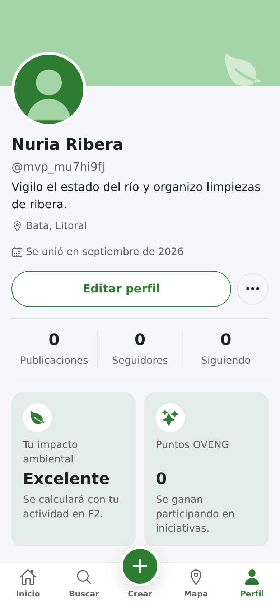
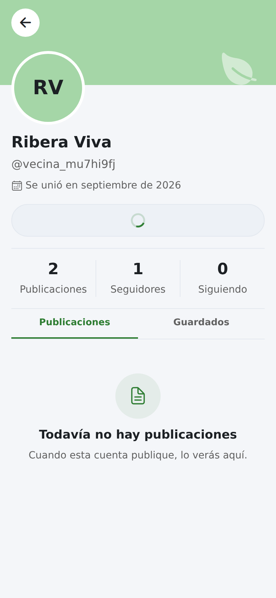
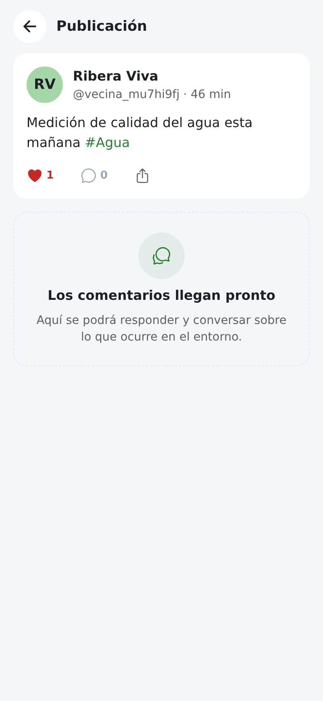

# OVENG EnvHealth

[](https://github.com/ExpeAvomo15/oveng-envhealth/actions/workflows/deploy.yml)

Red social ambiental que conecta personas, empresas e iniciativas verdes: feed
social, mapa ambiental (aire, agua, suelo, biodiversidad), valoraciones
comunitarias y huella ecológica personal.

**Demo:** https://expeavomo15.github.io/oveng-envhealth/

---

## Estado: MVP social completo

La fase F1 está cerrada y etiquetada como `v0.1-mvp`. El ciclo social funciona
de punta a punta contra Supabase real:

| | |
| --- | --- |
| **Cuentas** | Registro, inicio de sesión, recuperación de contraseña y sesión persistente en web y nativo. |
| **Perfiles** | Portada, avatar subido a Storage, biografía, ubicación, contadores reales y perfil público en `/user/[username]`. |
| **Seguir** | Seguir y dejar de seguir con actualización optimista y contadores cuadrados con la base de datos. |
| **Publicar** | Compositor con texto, etiquetas extraídas del propio texto y una imagen reducida antes de subirse. |
| **Feed** | "Para ti" y "Siguiendo", paginación por cursor, "me gusta", compartir y detalle de publicación. |

Lo que **todavía no hace**: buscar, mapa ambiental, comentarios, valoraciones
con puntuación y huella ecológica. Todo eso es F2 — ver el roadmap abajo.

### El recorrido, en imágenes

| | | |
| --- | --- | --- |
|  |  |  |
| Bienvenida | Feed con publicación propia | Compositor con imagen |
|  |  |  |
| Perfil propio | Siguiendo a otra cuenta | Detalle de publicación |

El recorrido completo está en [`docs/verificacion/mvp/`](docs/verificacion/mvp/),
generado automáticamente por `npm run verify:mvp`.

## Stack

- **App:** React Native + Expo SDK 57 + TypeScript estricto + expo-router
- **Backend:** Supabase (Auth, Postgres con RLS, Storage)
- **Web:** export estático de Expo publicado en GitHub Pages vía GitHub Actions

Una sola base de código para web, iOS y Android. La demo se sirve en web; el
producto es móvil.

## Documentación

| Documento | Qué contiene |
| --------- | ------------ |
| [AGENTS.md](AGENTS.md) | Reglas de trabajo, convenciones y protocolo. Fuente única de verdad. |
| [docs/plan.md](docs/plan.md) | Plan vivo por fases y tareas. El estado real del proyecto. |
| [docs/notas.md](docs/notas.md) | Bitácora de decisiones y aprendizajes, con fecha. |
| [docs/00_VISION.md](docs/00_VISION.md) | Producto, usuarios objetivo y las 5 secciones de la app. |
| [docs/01_ARQUITECTURA.md](docs/01_ARQUITECTURA.md) | Arquitectura y decisiones técnicas. |
| [docs/03_MODELO_DATOS.md](docs/03_MODELO_DATOS.md) | Esquema, RLS, storage y cómo aplicar las migraciones. |
| [docs/design/](docs/design/) | Mockups oficiales — referencia estética vinculante. |

## Puesta en marcha

```bash
npm install
cp .env.example .env   # rellenar con la URL y la clave anon de Supabase
npm run web            # abre la app en el navegador
npm start              # dev server: elegir web, Android o iOS (Expo Go)
```

El esquema se aplica a mano una sola vez siguiendo
[docs/03_MODELO_DATOS.md](docs/03_MODELO_DATOS.md).

### Comprobaciones

```bash
npm run typecheck      # tsc --noEmit
npm run lint           # eslint
npm run verify:mvp     # recorrido completo en Chromium, con capturas
```

| Script | Qué verifica |
| ------ | ------------ |
| `verify:auth` | Ciclo de autenticación contra Supabase, sin navegador. |
| `verify:ui` | Navegación, modal y persistencia de sesión. |
| `verify:f13` | Perfiles, avatar y seguimiento, con RLS. |
| `verify:f14` | Compositor, etiquetas, imagen y límite de caracteres. |
| `verify:f15` | Feed, paginación, "me gusta" y filtro "Siguiendo". |
| `verify:mvp` | El recorrido completo de punta a punta. |

Todos construyen con `--clear` y comprueban que el bundle apunta al proyecto
del `.env` antes de dar nada por bueno.

## Estructura

```
src/
├── app/            # rutas de expo-router (+html.tsx = documento de la build web)
├── components/     # ui/ (design system), feed/, profile/, navigation/, brand/
├── hooks/          # sesión y feed
├── lib/            # cliente de Supabase, consultas y utilidades de dominio
├── theme/          # tokens: color, espaciado, radios, tipografía, categorías
└── types/          # tipos globales del entorno
supabase/migrations/ # esquema SQL; se aplica a mano desde el SQL Editor
scripts/            # verificación y mantenimiento
docs/               # documentación viva y capturas de verificación
```

### Design system

Todo el color, tamaño y radio sale de `src/theme/`: la UI usa tokens con
significado (`colors.accent`), nunca un hex suelto, y escribe con
`<Text variant="...">` en vez de `fontSize` a mano. Dos reglas:

- **El verde es acento, no fondo.** Las superficies son neutras.
- **El color del texto sobre un relleno se decide midiendo su luminancia.** El
  azul y el amarillo de la paleta no llegan al mínimo de contraste como texto.
  El razonamiento y las medidas están en `src/theme/colors.ts`.

### Backend

`src/lib/supabase.ts` es el único punto de acceso. Necesita
`EXPO_PUBLIC_SUPABASE_URL` y `EXPO_PUBLIC_SUPABASE_ANON_KEY` en `.env` y falla
al arrancar si faltan.

Esas claves son públicas por diseño: van incrustadas en el bundle. Lo que
protege los datos es **RLS en Postgres**, así que toda tabla nueva se crea con
RLS activado y sus políticas en la misma migración.

## Desarrollo

### Limpiar cuentas de prueba

Los scripts de verificación crean cuentas con correos `@ovengtest.dev`. Borrar
un usuario de `auth.users` requiere la clave `service_role`, que **salta RLS** y
da acceso total al proyecto.

```bash
SUPABASE_SERVICE_ROLE_KEY='...' npm run cleanup:test-users            # simulacro
SUPABASE_SERVICE_ROLE_KEY='...' npm run cleanup:test-users -- --confirm
```

> ⚠️ **Esa clave nunca se guarda en un fichero.** No va en `.env`, ni en
> `.env.example`, ni en variables de GitHub. Se pasa solo en el momento de
> ejecutar el script, que además se niega a funcionar si la encuentra en `.env`.

El script solo borra cuentas cuyo correo termina en `@ovengtest.dev` — el
dominio está fijo en el código, no es un parámetro: una errata en un argumento
no puede llevarse por delante cuentas reales. Sin `--confirm` solo enumera.

## Despliegue

La web se publica sola en GitHub Pages en cada push a `main` con el workflow
[`deploy.yml`](.github/workflows/deploy.yml): `npm ci` →
`expo export --platform web --clear` → comprobaciones → Pages.

Las credenciales van en **Settings → Secrets and variables → Actions →
Variables** (no Secrets: acaban en el bundle, no son secretas):
`EXPO_PUBLIC_SUPABASE_URL` y `EXPO_PUBLIC_SUPABASE_ANON_KEY`.

Antes de publicar, el workflow comprueba que el bundle contiene la URL de
Supabase —caza una caché de Metro rancia, que ya publicó una vez un bundle
apuntando al proyecto equivocado—, que los assets cuelgan del subpath
`/oveng-envhealth/` y que `404.html` viaja en el artefacto.

**Si el repositorio cambia de nombre**, hay que actualizar
`expo.experiments.baseUrl` en `app.json` y el workflow.

## Roadmap — F2, demo ambiental

Lo que convierte esto en una red social **ambiental** y no en una red social
más. Propuesta a validar en [docs/plan.md](docs/plan.md):

1. **Entidades** — empresas e iniciativas como tabla propia, con datos de
   ejemplo. `profiles` se queda para personas.
2. **Buscar** — búsqueda real de cuentas, etiquetas y lugares.
3. **Mapa ambiental** — capas de aire, agua, suelo y biodiversidad.
4. **Perfil ambiental** — huella ecológica y puntos OVENG con datos reales.
5. **Datos de zona en el feed** — el estado del entorno junto al contenido.

## Cómo se trabaja aquí

Una tarea del plan por commit, con mensaje `F<fase>.<tarea>: descripción`,
trunk-based en `main` y push tras cada tarea. Antes de escribir código, lee
[AGENTS.md](AGENTS.md) y [docs/plan.md](docs/plan.md).
