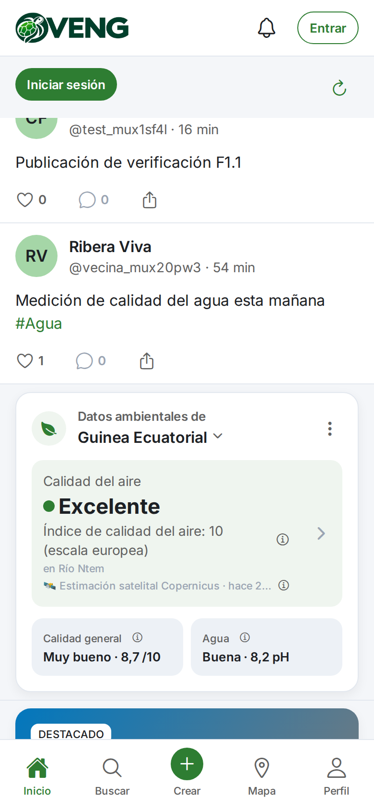
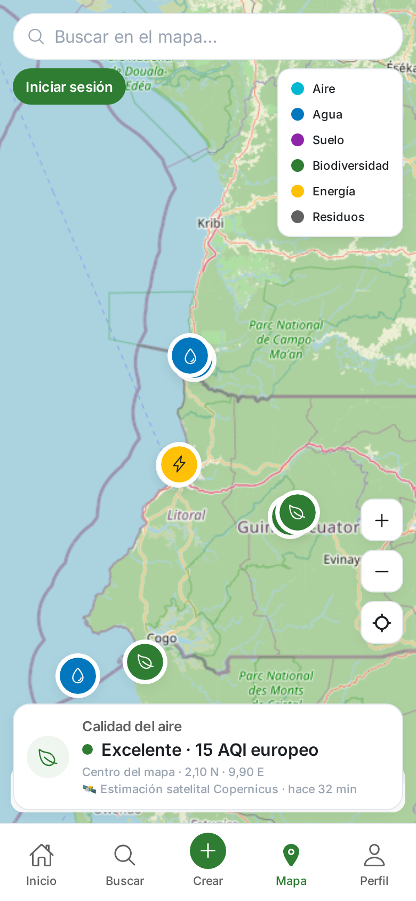
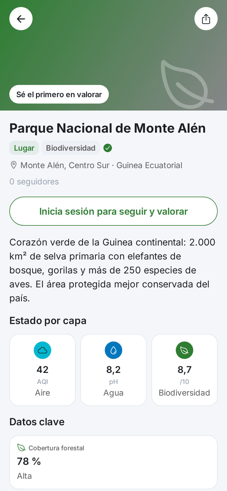
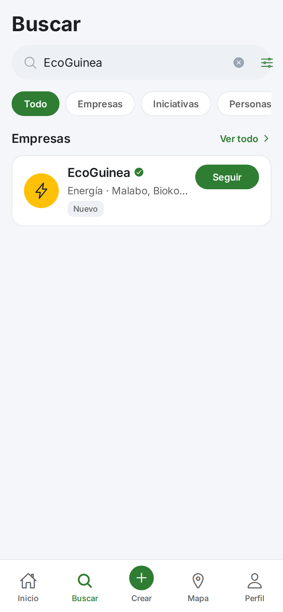
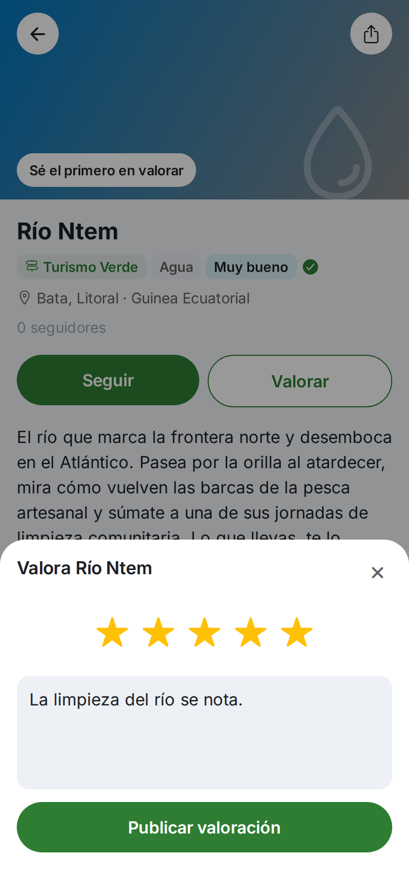
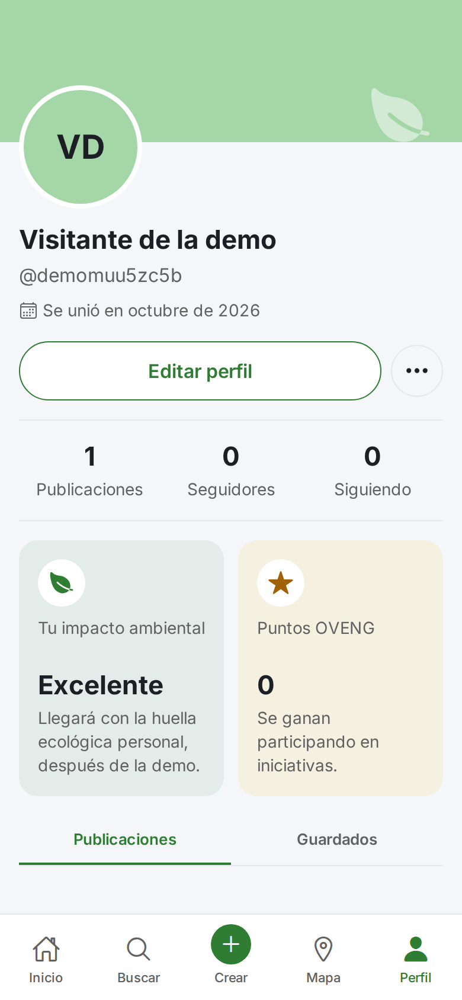

# OVENG EnvHealth

[](https://github.com/ExpeAvomo15/oveng-envhealth/actions/workflows/deploy.yml)

Red social ambiental que conecta personas, empresas e iniciativas verdes: feed
social, mapa ambiental (aire, agua, suelo, biodiversidad), valoraciones
comunitarias y huella ecológica personal.

**Demo:** https://expeavomo15.github.io/oveng-envhealth/

---

## Estado: demo completa

La fase F1 está cerrada y etiquetada como `v0.1-mvp`. El ciclo social funciona
de punta a punta contra Supabase real:

| | |
| --- | --- |
| **Cuentas** | Registro, inicio de sesión, recuperación de contraseña de punta a punta (`/restablecer`) y sesión persistente en web y nativo. El email de recuperación necesita SMTP propio: ver [docs/01_ARQUITECTURA.md](docs/01_ARQUITECTURA.md). |
| **Perfiles** | Portada, avatar subido a Storage, biografía, ubicación, contadores reales y perfil público en `/user/[username]`. |
| **Seguir** | Seguir y dejar de seguir con actualización optimista y contadores cuadrados con la base de datos. |
| **Publicar** | Compositor con texto, etiquetas extraídas del propio texto y una imagen reducida antes de subirse. |
| **Feed** | "Para ti" y "Siguiendo", paginación por cursor, "me gusta", compartir y detalle de publicación. |

Sobre eso, **F2.1 a F2.3** construyen lo ambiental: `entities` (lugares,
empresas e iniciativas) con sus métricas y valoraciones y catorce entidades de
ejemplo —cinco lugares reales de Guinea Ecuatorial con sus coordenadas
verdaderas—, el **directorio** en Buscar con seguimiento de entidades, y el
**mapa ambiental** con las catorce sobre el territorio, filtrables por capa.

**F2.4** convierte la ficha de una entidad en su perfil ambiental: calidad
general, estado por capa, datos clave y las valoraciones de la comunidad. Y
**F2.5** mete el dato ambiental **dentro del feed**: la calidad del aire de tu
zona entre las publicaciones, diciendo qué lugar la mide, con la zona elegible.
Eso cierra F2.

Y **F2.6** cierra la demo: **el feed, el mapa y los perfiles de entidad se ven
sin cuenta.** Publicar, seguir, valorar y el filtro "Siguiendo" siguen
pidiéndola, y lo dicen. Es el principio de utilidad individual de
[docs/07_CRECIMIENTO.md](docs/07_CRECIMIENTO.md): el producto tiene que servir a
quien llega solo.

Lo que **todavía no hace**: capas de datos ambientales sobre el territorio (el
mapa enseña entidades, no superficies), comentarios en las publicaciones, y la
huella ecológica de las personas. Ver el roadmap.

### Cómo ver la demo en dos minutos

En **https://expeavomo15.github.io/oveng-envhealth/** y **sin crear cuenta**:

1. **Abre la demo.** Entras directamente al feed: no hay muro de registro.
2. **Baja un poco.** Entre las publicaciones aparece *"Datos ambientales de
   Guinea Ecuatorial"*, con la calidad del aire **de ahora mismo** en el Río
   Ntem y de dónde sale: *"🛰️ Estimación satelital Copernicus · hace X min"*.
3. **Toca el nombre de la zona** y cambia a Málaga y Andalucía. OVENG no tiene
   ningún lugar medido allí, pero el aire de Málaga existe y se ve en vivo.
4. **Ve al Mapa.** Las catorce entidades sobre el territorio, con el color de su
   categoría, y abajo el aire del **centro del encuadre**. Busca cualquier
   ciudad del mundo —"Douala", "Sevilla"— y el mapa vuela allí con su aire, o
   pulsa **Mi ubicación** para ver el tuyo.
5. **Elige una capa** en la leyenda de la derecha: quedan sus marcadores y la
   tarjeta de abajo enseña **su** dato —el suelo en vivo, la naturaleza
   registrada cerca, el agua de un lugar medido o lo que hay de energía—.
   Toca cualquier ⓘ y te lo explica en palabras llanas.
6. **Toca el marcador de Monte Alén** y abre su tarjeta.
7. **Entra en su perfil ambiental**: el aire en vivo de sus coordenadas y,
   debajo, los datos de referencia del perfil —aire 42 AQI, agua 8,2 pH,
   biodiversidad 8,7/10 y cobertura forestal 78 %, exactamente los del
   mockup—, cada uno diciendo de dónde sale. No tiene círculo de calidad
   general porque el mockup no se lo da.
8. **Intenta valorar.** Ahí sí se pide cuenta, y el botón lo dice.

Con cuenta se cierra el ciclo: publicar con etiquetas, "me gusta", buscar y
seguir una empresa, y valorar un lugar.

El recorrido completo, paso a paso y con capturas, lo genera
`npm run verify:demo` en [`docs/verificacion/demo/`](docs/verificacion/demo/).

### El recorrido, en imágenes

| | | |
| --- | --- | --- |
|  |  |  |
| Los datos de tu zona, entre las publicaciones | El mapa con las catorce entidades | El perfil ambiental de Monte Alén |
|  |  |  |
| El directorio en Buscar | Valorar un lugar | El perfil propio |

Las diecinueve capturas del recorrido, en orden, están en
[`docs/verificacion/demo/`](docs/verificacion/demo/) y las genera
`npm run verify:demo`. El recorrido social del MVP sigue en
[`docs/verificacion/mvp/`](docs/verificacion/mvp/).

## Stack

- **App:** React Native + Expo SDK 57 + TypeScript estricto + expo-router
- **Mapa (web):** MapLibre GL JS con teselas raster de OpenStreetMap — sin clave
  de API. En nativo hay un marcador de posición: es una librería de navegador.
- **Backend:** Supabase (Auth, Postgres con RLS, Storage)
- **Web:** export estático de Expo publicado en GitHub Pages vía GitHub Actions

Una sola base de código para web, iOS y Android. La demo se sirve en web; el
producto es móvil.

## Documentación

| Documento | Qué contiene |
| --------- | ------------ |
| [AGENTS.md](AGENTS.md) | Reglas de trabajo, convenciones y protocolo. Fuente única de verdad. |
| [docs/plan.md](docs/plan.md) | Plan vivo por fases y tareas. El estado real del proyecto. |
| [docs/notas.md](docs/notas.md) | Bitácora viva: decisiones vigentes, pendientes y las dos últimas sesiones. |
| [docs/notas-archivo-f0-f2.md](docs/notas-archivo-f0-f2.md) | Bitácora íntegra de F0 a F2, archivada. |
| [docs/00_VISION.md](docs/00_VISION.md) | Producto, usuarios objetivo y las 5 secciones de la app. |
| [docs/01_ARQUITECTURA.md](docs/01_ARQUITECTURA.md) | Arquitectura y decisiones técnicas. |
| [docs/03_MODELO_DATOS.md](docs/03_MODELO_DATOS.md) | Esquema, RLS, storage y cómo aplicar las migraciones. |
| [docs/07_CRECIMIENTO.md](docs/07_CRECIMIENTO.md) | Estrategia de crecimiento y comunidad, y lo que obliga a construir. |
| [docs/08_DATOS_EN_VIVO.md](docs/08_DATOS_EN_VIVO.md) | F4: dato ambiental vivo, fuentes y procedencia. |
| [docs/design/](docs/design/) | Mockups oficiales — referencia estética vinculante. |

## Puesta en marcha

```bash
npm install
cp .env.example .env   # rellenar con la URL y la clave anon de Supabase
npm run web            # abre la app en el navegador
npm start              # dev server: elegir web, Android o iOS (Expo Go)
```

El esquema se aplica a mano una sola vez siguiendo
[docs/03_MODELO_DATOS.md](docs/03_MODELO_DATOS.md).

### Comprobaciones

```bash
npm run typecheck      # tsc --noEmit
npm run lint           # eslint
npm run verify:mvp     # recorrido completo en Chromium, con capturas
```

| Script | Qué verifica |
| ------ | ------------ |
| `verify:auth` | Ciclo de autenticación contra Supabase, sin navegador. |
| `verify:ui` | Navegación, modal y persistencia de sesión. |
| `verify:f13` | Perfiles, avatar y seguimiento, con RLS. |
| `verify:f14` | Compositor, etiquetas, imagen y límite de caracteres. |
| `verify:f15` | Feed, paginación, "me gusta" y filtro "Siguiendo". |
| `verify:f21` | Entidades: esquema de la migración 003, seed cargado, coordenadas, métricas y RLS. |
| `verify:f22` | Buscar: directorio, filtros, navegación a la ficha de entidad y seguir entidades. |
| `verify:f23` | Mapa: marcadores, filtro por capa, tarjetas, acceso sin cuenta y limpieza del mapa. |
| `verify:f24` | Perfil de entidad: métricas fieles al seed, valoraciones y su RLS. |
| `verify:f25` | Datos de zona en el feed: posición, paginación, cambio de zona y persistencia. |
| `verify:f41` | Aire en vivo de Open-Meteo: la API, el feed, el mapa al moverlo, el perfil y la API caída. Sin cuenta y sin escribir nada. |
| `verify:f42` | Mapa mundial: buscar lugares, "Mi ubicación" concedida y denegada, y la ubicación en el feed. Sin cuenta, con la ubicación simulada. |
| `verify:f43` | Cada capa del mapa con su dato (suelo, naturaleza, agua, energía, residuos), cada ⓘ, las fuentes caídas, el perfil y recuperar contraseña. |
| `verify:f44` | Feed denso, Turismo Verde con publicaciones etiquetadas, reclamar una página y publicar ofertas, y su RLS. Necesita las migraciones 005–007 y `seed:jobs`. |
| `verify:f45` | Turismo Verde por ubicación: distancia, "Cómo llegar", "Cerca de mí" y el vacío honesto. |
| `verify:f46` | Chat 1 a 1: solicitud y aceptación, tiempo real entre dos sesiones, no leídos, bloqueo, y que una tercera cuenta no ve nada. Necesita la migración 008. |
| `verify:mvp` | El recorrido social de punta a punta (F1). |
| `verify:demo` | **La demo completa**: el recorrido de un visitante, sin cuenta y con ella, incluido abrir una publicación, un perfil ajeno y Buscar sin cuenta. |

Los que abren navegador construyen con `--clear` y comprueban que el bundle
apunta al proyecto del `.env` antes de dar nada por bueno. `verify:auth` y
`verify:f21` no necesitan navegador: hablan con la base directamente, con la
clave anónima, que es la que usa la app.

Cada uno deja sus capturas en su propio subdirectorio de
[`docs/verificacion/`](docs/verificacion/) y limpia solo el suyo.

## Rendimiento

Medido en F2.6, sin optimizar nada grande: la demo es una demo y el sitio de
optimizar es cuando haya a quién.

| | |
| --- | --- |
| Artefacto publicado (`dist`) | **5,4 MB** |
| JavaScript del cliente | 2,8 MB en un solo *bundle* |
| Fuentes (`.ttf`) | 1,68 MB — cuatro pesos de Inter y los iconos |
| HTML prerenderizado | 24 páginas, 0,5 MB |
| CSS | 81 KB, de los que 83 KB son la hoja de MapLibre |

Y lo que tarda en llegar, medido contra Pages (tres peticiones, mejor de tres):

| | |
| --- | --- |
| HTML de entrada | 24 KB · TTFB **0,19 s** |
| Feed interactivo desde cero | **6,4 s** en un navegador limpio |
| Bundle de JavaScript | 2,89 MB, un solo fichero |
| Hoja de MapLibre | 83 KB |

El HTML llega en menos de un cuarto de segundo porque está prerenderizado; lo
que manda en la primera visita es el bundle de JavaScript.

El único arreglo que se hizo aquí valía la pena: el export llevaba **las
dieciocho** variantes de Inter (6,3 MB) porque se importaban desde el índice del
paquete, y un asset no se elimina por no usarse. Importando cada peso por su
subruta entran solo los cuatro que usa el theme, y el artefacto **baja de 10 MB
a 5,4 MB**. El navegador nunca descargó las otras catorce, pero viajaban en cada
despliegue.

Lo que **no** se ha tocado, anotado en [docs/notas.md](docs/notas.md): el bundle
de JavaScript es único y MapLibre es un tercio largo de él, así que partirlo por
rutas es la siguiente palanca — y es trabajo de verdad, no un quick win.

## Estructura

```
src/
├── app/            # rutas de expo-router (+html.tsx = documento de la build web)
├── components/     # ui/ (design system), feed/, profile/, navigation/, brand/
├── hooks/          # sesión y feed
├── lib/            # cliente de Supabase, consultas y utilidades de dominio
├── theme/          # tokens: color, espaciado, radios, tipografía, categorías
└── types/          # tipos globales del entorno
supabase/migrations/ # esquema SQL; se aplica a mano desde el SQL Editor
scripts/            # verificación y mantenimiento
docs/               # documentación viva y capturas de verificación
```

### Design system

Todo el color, tamaño y radio sale de `src/theme/`: la UI usa tokens con
significado (`colors.accent`), nunca un hex suelto, y escribe con
`<Text variant="...">` en vez de `fontSize` a mano. Dos reglas:

- **El verde es acento, no fondo.** Las superficies son neutras.
- **El color del texto sobre un relleno se decide midiendo su luminancia.** El
  azul y el amarillo de la paleta no llegan al mínimo de contraste como texto.
  El razonamiento y las medidas están en `src/theme/colors.ts`.

### Backend

`src/lib/supabase.ts` es el único punto de acceso. Necesita
`EXPO_PUBLIC_SUPABASE_URL` y `EXPO_PUBLIC_SUPABASE_ANON_KEY` en `.env` y falla
al arrancar si faltan.

Esas claves son públicas por diseño: van incrustadas en el bundle. Lo que
protege los datos es **RLS en Postgres**, así que toda tabla nueva se crea con
RLS activado y sus políticas en la misma migración.

## Desarrollo

### Cargar las entidades de ejemplo

La migración `003` crea las tablas de entidades vacías; el contenido lo mete el
seed: catorce lugares, empresas e iniciativas con sus métricas.

```bash
SUPABASE_SERVICE_ROLE_KEY='...' npm run seed:entities -- --dry-run   # solo enumera
SUPABASE_SERVICE_ROLE_KEY='...' npm run seed:entities                # escribe
SUPABASE_SERVICE_ROLE_KEY='...' npm run seed:jobs                    # ofertas de ejemplo (F4.4)
```

Necesita `service_role` porque `entities` y `entity_metrics` **no tienen ninguna
política de escritura**: son contenido curado y la app no puede tocarlas. Mismo
trato que abajo — la clave se pasa al ejecutar y no se guarda en ningún fichero.

Es idempotente por `slug`: repetirlo actualiza en vez de duplicar. Comprobar con
`npm run verify:f21`.

### Limpiar cuentas de prueba

Los scripts de verificación crean cuentas con correos `@ovengtest.dev`. Borrar
un usuario de `auth.users` requiere la clave `service_role`, que **salta RLS** y
da acceso total al proyecto.

```bash
SUPABASE_SERVICE_ROLE_KEY='...' npm run cleanup:test-users            # simulacro
SUPABASE_SERVICE_ROLE_KEY='...' npm run cleanup:test-users -- --confirm
```

> ⚠️ **Esa clave nunca se guarda en un fichero.** No va en `.env`, ni en
> `.env.example`, ni en variables de GitHub. Se pasa solo en el momento de
> ejecutar el script, que además se niega a funcionar si la encuentra en `.env`.

El script solo borra cuentas cuyo correo termina en `@ovengtest.dev` — el
dominio está fijo en el código, no es un parámetro: una errata en un argumento
no puede llevarse por delante cuentas reales. Sin `--confirm` solo enumera.

## Despliegue

La web se publica sola en GitHub Pages en cada push a `main` con el workflow
[`deploy.yml`](.github/workflows/deploy.yml): `npm ci` →
`expo export --platform web --clear` → comprobaciones → Pages.

Las credenciales van en **Settings → Secrets and variables → Actions →
Variables** (no Secrets: acaban en el bundle, no son secretas):
`EXPO_PUBLIC_SUPABASE_URL` y `EXPO_PUBLIC_SUPABASE_ANON_KEY`.

Antes de publicar, el workflow comprueba que el bundle contiene la URL de
Supabase —caza una caché de Metro rancia, que ya publicó una vez un bundle
apuntando al proyecto equivocado—, que los assets cuelgan del subpath
`/oveng-envhealth/` y que `404.html` viaja en el artefacto.

**Si el repositorio cambia de nombre**, hay que actualizar
`expo.experiments.baseUrl` en `app.json` y el workflow.

## Roadmap — F2, demo ambiental

Lo que convierte esto en una red social **ambiental** y no en una red social
más. Estado real de cada tarea en [docs/plan.md](docs/plan.md):

1. ~~**Entidades**~~ — **hecho (F2.1).** Empresas, iniciativas y lugares en su
   propia tabla, con métricas, valoraciones y contenido de ejemplo cargado.
   `profiles` se queda para personas.
2. ~~**Buscar**~~ — **hecho (F2.2).** Directorio de entidades y personas, con
   filtros por tipo y seguimiento de entidades.
3. ~~**Mapa ambiental**~~ — **hecho (F2.3).** Las catorce entidades sobre el
   territorio, con leyenda que filtra por capa. Las capas de datos ambientales
   sobre el mapa —superficies de aire, agua, suelo— siguen pendientes.
4. ~~**Perfil ambiental**~~ — **hecho (F2.4)**, el de las entidades: métricas
   fieles al seed y valoraciones de la comunidad. La huella ecológica de las
   personas sigue pendiente.
5. ~~**Datos de zona en el feed**~~ — **hecho (F2.5).** El estado del entorno
   entre las publicaciones, con la zona elegida por quien mira.

**F2 está completa.** Lo siguiente es F3 — comunidad y lanzamiento, en
[docs/07_CRECIMIENTO.md](docs/07_CRECIMIENTO.md) — y después F4, el dato
ambiental vivo de cualquier coordenada con su procedencia a la vista, en
[docs/08_DATOS_EN_VIVO.md](docs/08_DATOS_EN_VIVO.md). Lo que quedó fuera del
alcance de F2 está anotado en [docs/plan.md](docs/plan.md).

Cómo se consigue que haya gente dentro —comunidad inicial, distribución y qué
obliga a construir, como que el mapa se pueda ver sin cuenta— está en
[docs/07_CRECIMIENTO.md](docs/07_CRECIMIENTO.md), con las tareas en F3 del plan.

## Cómo se trabaja aquí

Una tarea del plan por commit, con mensaje `F<fase>.<tarea>: descripción`,
trunk-based en `main` y push tras cada tarea. Antes de escribir código, lee
[AGENTS.md](AGENTS.md) y [docs/plan.md](docs/plan.md).
