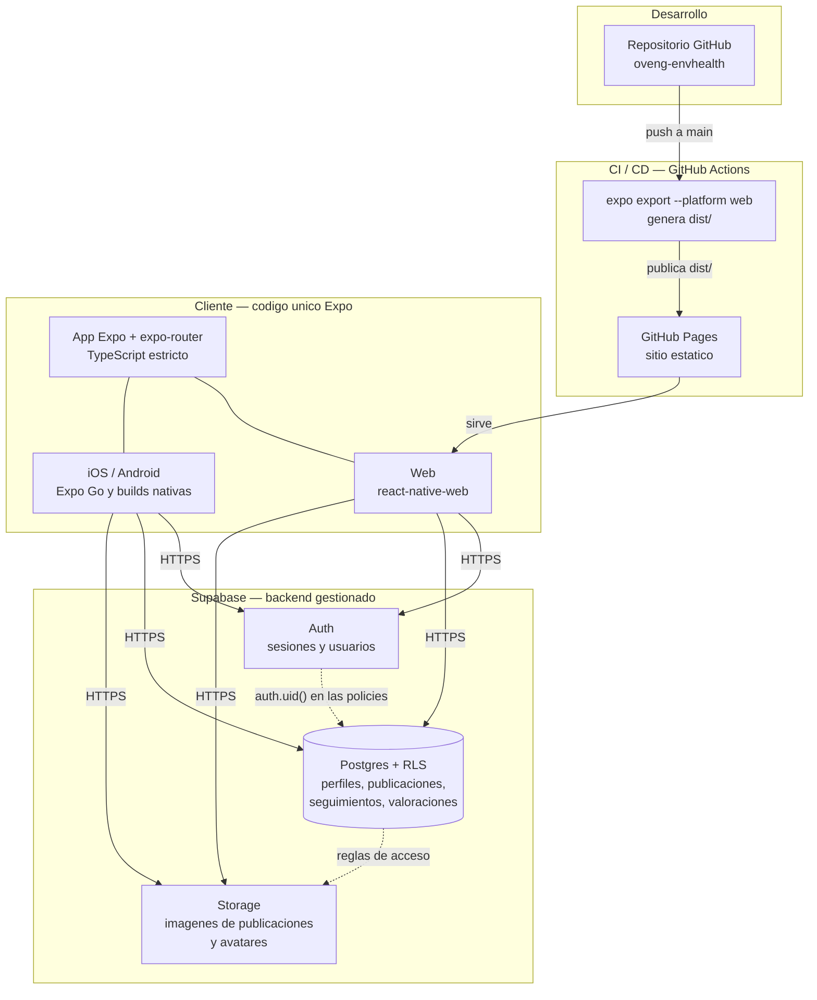

# 01 — Arquitectura

## Visión general

Una sola base de código Expo (React Native + TypeScript) produce la app móvil y
el sitio web. El backend es Supabase gestionado: la app habla directamente con
él desde el cliente, con la seguridad aplicada en la base de datos mediante RLS.
No hay servidor propio.

## Decisiones tomadas

### Expo como único cliente

Una base de código para web, iOS y Android. La demo se entrega en web, pero el
producto es móvil: empezar en Expo evita reescribir la app cuando el objetivo
se mueve a las tiendas. `expo-router` da navegación basada en ficheros, lo que
mantiene la estructura de las 5 secciones legible en el árbol de carpetas.

**Coste asumido:** el export web de React Native no es una web nativa; hay
componentes (especialmente el mapa) que necesitarán una variante por
plataforma. Se acepta a cambio de no mantener dos apps.

### Supabase como backend, sin capa propia

Auth, Postgres y Storage gestionados, con el cliente hablando directo contra la
API. Elimina el trabajo de construir y desplegar un backend para un MVP cuyas
operaciones son CRUD sobre entidades sociales.

**Implicación crítica:** la autorización vive en **RLS**, no en el cliente. Toda
tabla nueva nace con RLS activado y sus policies escritas en la misma
migración; una tabla sin policies es una tabla abierta a internet. Solo la clave
anónima llega al cliente — la `service_role` nunca sale del servidor ni entra en
el repositorio.

### TypeScript estricto desde el día uno

`strict: true` desde el scaffold. Activarlo más tarde sobre código ya escrito es
una migración; activarlo antes de la primera línea no cuesta nada. Los tipos de
la base de datos se generarán desde el esquema de Supabase para que un cambio en
Postgres rompa la compilación en lugar de romper la app en ejecución.

### Deploy web en GitHub Pages

`expo export --platform web` produce un sitio estático que Pages sirve sin coste
ni infraestructura, y el workflow de Actions publica en cada push a `main`. El
repositorio y el despliegue viven en el mismo sitio.

**Coste asumido:** Pages sirve estáticos y nada más — sin SSR ni rutas de
servidor. La app es un SPA que carga sus datos desde Supabase en el cliente, así
que no hace falta. La app se sirve bajo un subdirectorio (`/oveng-envhealth/`),
lo que exige configurar la base pública del router en F1.2b.

### Secretos y configuración

Solo variables públicas del cliente (URL del proyecto y clave anónima de
Supabase) llegan al bundle, vía `.env` local y secretos de repositorio en
Actions. `.env` nunca se commitea; `.env.example` documenta qué hace falta. La
clave anónima es pública por diseño — lo que la hace segura es RLS, no el
secreto.

### Trunk-based en `main`

Un commit por tarea del plan, push inmediato, tag anotado al cerrar fase. Sin
ramas ni PRs: con un desarrollador y agentes no hay revisor humano al que servir,
y el historial por tareas es lo que hace auditable lo que hizo cada sesión.

## Pendiente de decidir

- Proveedor de mapa y capas ambientales (F2).
- Fuente de los datos ambientales: APIs públicas, carga manual o mediciones de
  la comunidad (F2).
- Estrategia de verificación de cuentas de empresa (fuera del MVP).

El modelo de datos se documenta en @docs/03_MODELO_DATOS.md al cerrar F0.3.
