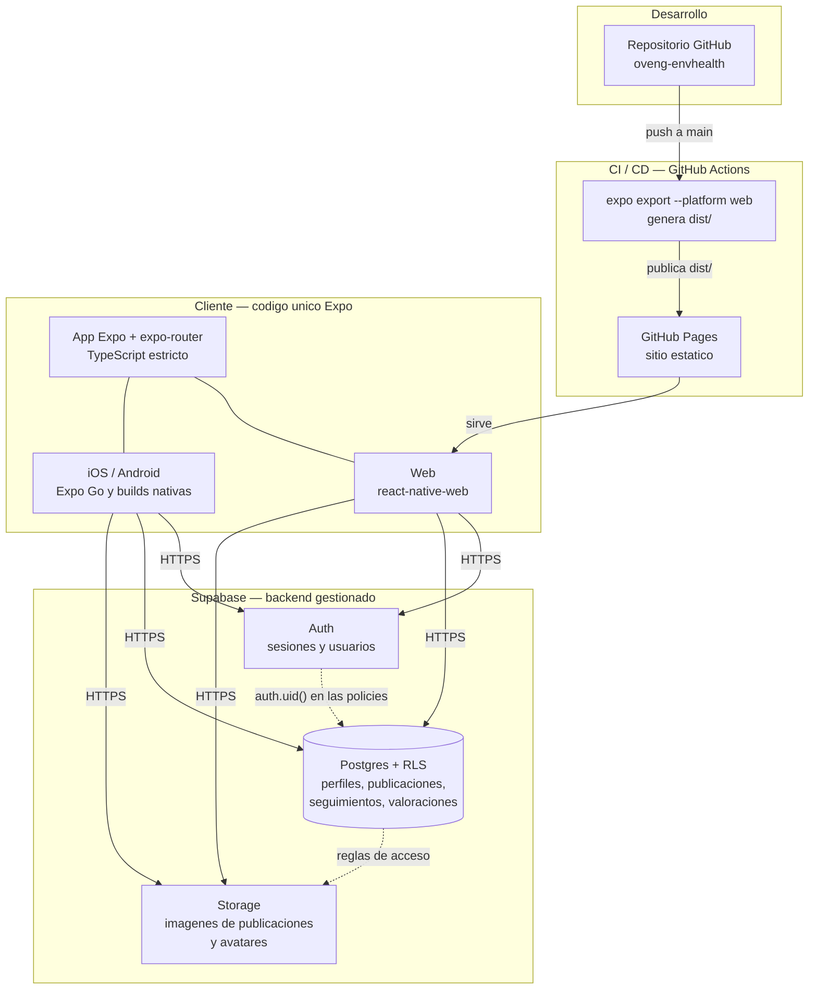

# 01 — Arquitectura

## Visión general

Una sola base de código Expo (React Native + TypeScript) produce la app móvil y
el sitio web. El backend es Supabase gestionado: la app habla directamente con
él desde el cliente, con la seguridad aplicada en la base de datos mediante RLS.
No hay servidor propio.

```mermaid
graph TB
    subgraph dev["Desarrollo"]
        repo["Repositorio GitHub<br/>oveng-envhealth"]
    end

    subgraph ci["CI / CD — GitHub Actions"]
        build["expo export --platform web<br/>genera dist/"]
        pages["GitHub Pages<br/>sitio estatico"]
    end

    subgraph client["Cliente — codigo unico Expo"]
        app["App Expo + expo-router<br/>TypeScript estricto"]
        web["Web<br/>react-native-web"]
        native["iOS / Android<br/>Expo Go y builds nativas"]
    end

    subgraph backend["Supabase — backend gestionado"]
        auth["Auth<br/>sesiones y usuarios"]
        db[("Postgres + RLS<br/>perfiles, publicaciones,<br/>seguimientos, valoraciones")]
        storage["Storage<br/>imagenes de publicaciones<br/>y avatares"]
    end

    repo -->|push a main| build
    build -->|publica dist/| pages
    app --- web
    app --- native
    pages -->|sirve| web
    web -->|HTTPS| auth
    web -->|HTTPS| db
    web -->|HTTPS| storage
    native -->|HTTPS| auth
    native -->|HTTPS| db
    native -->|HTTPS| storage
    auth -.->|"auth.uid() en las policies"| db
    db -.->|"reglas de acceso"| storage
```

## Decisiones tomadas

### Expo como único cliente

Una base de código para web, iOS y Android. La demo se entrega en web, pero el
producto es móvil: empezar en Expo evita reescribir la app cuando el objetivo
se mueve a las tiendas. `expo-router` da navegación basada en ficheros, lo que
mantiene la estructura de las 5 secciones legible en el árbol de carpetas.

**Coste asumido:** el export web de React Native no es una web nativa; hay
componentes que necesitan una variante por plataforma. **Ya pasó con el mapa**
(F2.3): MapLibre GL JS es una librería de navegador, así que el mapa real vive
en `environmental-map.web.tsx` y en nativo hay un marcador de posición, con el
mapa nativo anotado como tarea posterior. Metro elige el archivo por la
extensión y ninguna pantalla tiene que saber en cuál está. Se acepta a cambio de
no mantener dos apps.

### Supabase como backend, sin capa propia

Auth, Postgres y Storage gestionados, con el cliente hablando directo contra la
API. Elimina el trabajo de construir y desplegar un backend para un MVP cuyas
operaciones son CRUD sobre entidades sociales.

**Implicación crítica:** la autorización vive en **RLS**, no en el cliente. Toda
tabla nueva nace con RLS activado y sus policies escritas en la misma
migración; una tabla sin policies es una tabla abierta a internet. Solo la clave
anónima llega al cliente — la `service_role` nunca sale del servidor ni entra en
el repositorio.

### TypeScript estricto desde el día uno

`strict: true` desde el scaffold. Activarlo más tarde sobre código ya escrito es
una migración; activarlo antes de la primera línea no cuesta nada. Los tipos de
la base de datos (`src/lib/database.types.ts`) se escribieron a mano siguiendo
las migraciones, con el comando para regenerarlos desde el esquema de Supabase
documentado en @docs/03_MODELO_DATOS.md: la base manda sobre lo escrito, y un
`git diff` vacío tras regenerar confirma que dicen lo mismo.

### Deploy web en GitHub Pages

`expo export --platform web` produce un sitio estático que Pages sirve sin coste
ni infraestructura, y el workflow de Actions publica en cada push a `main`. El
repositorio y el despliegue viven en el mismo sitio.

**Coste asumido:** Pages sirve estáticos y nada más — sin SSR ni rutas de
servidor. La app es un SPA que carga sus datos desde Supabase en el cliente, así
que no hace falta. La app se sirve bajo un subdirectorio (`/oveng-envhealth/`),
resuelto en F1.2b con `experiments.baseUrl` en `app.json` —atado al nombre del
repositorio—, y los enlaces profundos a rutas dinámicas entran por el fallback
de SPA de `public/404.html`.

El workflow comprueba el artefacto antes de publicarlo: que la URL de Supabase
está dentro del bundle, que los assets llevan el subpath y que existe
`404.html`. Publica en https://expeavomo15.github.io/oveng-envhealth/.

### Secretos y configuración

Solo variables públicas del cliente (URL del proyecto y clave anónima de
Supabase) llegan al bundle, vía `.env` local y **Variables** del repositorio en
Actions —no *Secrets*: acaban incrustadas en un bundle que descarga cualquiera,
así que esconderlas solo dificultaría verlas y editarlas—. Si faltan, el
workflow falla en su primer paso en vez de publicar una app que no conecta.
`.env` nunca se commitea; `.env.example` documenta qué hace falta. La clave
anónima es pública por diseño — lo que la hace segura es RLS, no el secreto.

La `service_role` no está ni en `.env` ni en GitHub: se pasa en el shell solo al
ejecutar el seed o la limpieza de cuentas de prueba.

### Trunk-based en `main`

Un commit por tarea del plan, push inmediato, tag anotado al cerrar fase. Sin
ramas ni PRs: con un desarrollador y agentes no hay revisor humano al que servir,
y el historial por tareas es lo que hace auditable lo que hizo cada sesión.

### El mapa: MapLibre GL JS con teselas de OpenStreetMap

Elegido en F2.3 por ser gratis y no pedir clave de API, que es lo que permite
que la demo se publique en Pages sin gestionar secretos. Las teselas raster de
openstreetmap.org dan el detalle que hacía falta; el estilo de demostración de
MapLibre se descartó porque llega a zoom 6 y a ese nivel Bata y Monte Alén son
el mismo punto.

**Es una decisión de demo, no de producto.** Las teselas son un servicio donado
con una política de uso que prohíbe el uso intenso, así que un lanzamiento
necesita proveedor propio. El razonamiento completo y los límites están en el
[archivo de notas, F2.3](notas-archivo-f0-f2.md#2026-09-27--f23-el-mapa-ambiental-y-las-rutas-públicas).

### Rutas públicas y privadas

**Toda vista de lectura es pública** (*lectura libre, cuenta para participar*,
@docs/07_CRECIMIENTO.md): el feed, Buscar, el mapa, la ficha de entidad, el
perfil de otra cuenta y el detalle de una publicación. Lo privado es lo propio:
el perfil propio, editarlo y crear. Las públicas viven fuera del grupo `(tabs)`
porque la guarda de ese grupo es de todo el grupo, y pintan ellas mismas la
barra de pestañas; dentro de `(tabs)` queda solo el perfil propio. Las rutas públicas se declaran **después** de los grupos
protegidos, porque expo-router toma como inicial la primera disponible, y
entrar o salir de sesión dice explícitamente a dónde va.

## Pendiente de decidir

F2 cerró la demo sin estas decisiones, a propósito; están en el backlog de
@docs/plan.md.

- Proveedor de teselas para producción, y con él la estética de satélite de los
  mockups.
- Capas de datos ambientales sobre el territorio: el mapa enseña entidades, no
  superficies.
- Fuente de los datos ambientales: **decidida para F4** —Open-Meteo como base
  mundial y OpenAQ donde haya estación, con la procedencia siempre visible—.
  Hoy todo es contenido curado del seed. Ver @docs/08_DATOS_EN_VIVO.md.
- Mapa en nativo: en iOS y Android hay un marcador de posición.
- Estrategia de verificación de cuentas de empresa.

El modelo de datos está en @docs/03_MODELO_DATOS.md.
