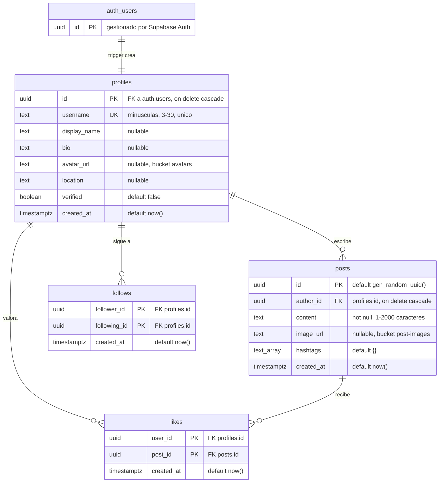

# 03 — Modelo de datos

Esquema de Supabase para el MVP: cuentas, publicaciones, seguimientos y
valoraciones. Definido en `supabase/migrations/`, tipado en
`src/lib/database.types.ts`.

**Principio que gobierna todo lo que sigue:** la autorización vive en la base de
datos, no en la app. El cliente lleva la clave anónima, que es pública; lo que
impide que alguien escriba en nombre de otro es RLS. Toda tabla nace con RLS
activado y sus políticas en la misma migración.

## Diagrama



`auth_users` es `auth.users`, el esquema que gestiona Supabase Auth: se dibuja
para entender de dónde sale un perfil, pero no se toca desde la app.

## Tablas

### profiles

Un perfil por cuenta. No se crea desde la app: lo crea el trigger al registrarse
(ver más abajo).

| Columna        | Tipo          | Notas |
| -------------- | ------------- | ----- |
| `id`           | `uuid` PK     | FK a `auth.users(id)`, `on delete cascade`: al borrar la cuenta desaparece todo lo suyo. |
| `username`     | `text` único  | Minúsculas, dígitos y `_`, de 3 a 30 caracteres (`profiles_username_format`). Va en URLs y menciones. |
| `display_name` | `text`        | Nombre visible. Nullable: el username hace de respaldo. |
| `bio`          | `text`        | Descripción libre. |
| `avatar_url`   | `text`        | URL pública en el bucket `avatars`. |
| `location`     | `text`        | Texto libre por ahora; cuando llegue el mapa (F2) hará falta algo geográfico. |
| `verified`     | `boolean`     | Cuenta verificada (empresas e iniciativas). |
| `created_at`   | `timestamptz` | |

**`verified` no lo puede cambiar su dueño.** La política de update solo
comprueba que seas tú, así que hoy podrías marcarte como verificado desde la
app. Está anotado como limitación abajo: la verificación real necesita una
columna protegida o una función aparte, y eso es trabajo de cuando exista el
flujo de verificación.

### posts

| Columna      | Tipo          | Notas |
| ------------ | ------------- | ----- |
| `id`         | `uuid` PK     | `gen_random_uuid()`. |
| `author_id`  | `uuid` FK     | `profiles.id`, `on delete cascade`. |
| `content`    | `text`        | No vacío y máximo 2000 caracteres. |
| `image_url`  | `text`        | URL pública en `post-images`. |
| `hashtags`   | `text[]`      | Default `{}`, nunca null: así el código no distingue entre "sin etiquetas" y "null". |
| `created_at` | `timestamptz` | |

Índices:

| Índice | Para qué |
| ------ | -------- |
| `posts_created_at_idx (created_at desc)` | Feed cronológico y descubrimiento. |
| `posts_author_created_at_idx (author_id, created_at desc)` | Publicaciones de un perfil y feed de cuentas seguidas: filtra y ordena en el mismo índice. |
| `posts_hashtags_idx` (GIN) | Búsqueda por etiqueta en la sección Buscar. |

### follows

Tabla de relación pura: `(follower_id, following_id)` es la clave primaria, así
que no se puede seguir dos veces a la misma cuenta. Un `check` impide seguirse a
uno mismo.

La PK ya sirve para "a quién sigo"; `follows_following_id_idx` cubre la pregunta
inversa, "quién me sigue".

### likes

Igual que `follows`: PK compuesta `(user_id, post_id)`, que hace imposible
valorar dos veces. `likes_post_id_idx` sirve para contar y listar las
valoraciones de una publicación.

## Políticas RLS

El mismo patrón en las cuatro tablas: **cualquiera lee, solo el propietario
escribe.**

| Tabla      | SELECT            | INSERT                       | UPDATE                       | DELETE                       |
| ---------- | ----------------- | ---------------------------- | ---------------------------- | ---------------------------- |
| `profiles` | público (`true`)  | `auth.uid() = id`            | `auth.uid() = id`            | `auth.uid() = id`            |
| `posts`    | público (`true`)  | `auth.uid() = author_id`     | `auth.uid() = author_id`     | `auth.uid() = author_id`     |
| `follows`  | público (`true`)  | `auth.uid() = follower_id`   | — sin política               | `auth.uid() = follower_id`   |
| `likes`    | público (`true`)  | `auth.uid() = user_id`       | — sin política               | `auth.uid() = user_id`       |

En `follows` y `likes` **no hay política de UPDATE a propósito**: esas filas no
tienen nada que actualizar — se crean o se borran. Sin política, RLS deniega, que
es exactamente el comportamiento correcto.

El SELECT es público de verdad (rol `anon` incluido): la web es visitable sin
cuenta. Que todo perfil y publicación sea legible por cualquiera es una decisión
de producto, no un descuido — no hay contenido privado en el MVP.

Las condiciones se escriben `(select auth.uid())` en vez de `auth.uid()` a
secas. Envuelto en un `select`, Postgres lo evalúa una vez por consulta en lugar
de una vez por fila; en un feed con paginación la diferencia se nota.

## Trigger: crear el perfil al registrarse

`public.handle_new_user()` se dispara `after insert on auth.users` y crea la
fila de `profiles`:

- El `username` sale de `raw_user_meta_data->>'username'` (lo que la app manda
  en el registro), en minúsculas. Si no viene, se genera `user_<8 hex del id>`.
- `display_name` sale de `raw_user_meta_data->>'display_name'`, o queda null.

Es `security definer` porque en ese instante todavía no hay sesión y RLS
bloquearía el insert. Lleva `set search_path = ''` —práctica recomendada de
Supabase contra el secuestro de `search_path`—, y por eso dentro de la función
todo va con el esquema explícito.

**Si el username ya existe o no cumple el formato, el registro entero falla.** Es
deliberado: es mejor que la app pida otro username a que la cuenta quede creada
con un nombre que el usuario no eligió. La pantalla de registro (F1.1) tiene que
tratar ese error.

## Storage

| Bucket        | Público | Tamaño máx. | Tipos                      |
| ------------- | ------- | ----------- | -------------------------- |
| `avatars`     | sí      | 2 MB        | JPEG, PNG, WebP            |
| `post-images` | sí      | 10 MB       | JPEG, PNG, WebP            |

Los límites se aplican en el servidor: un cliente manipulado no puede saltárselos.

**Convención de rutas: `{uid}/{archivo}`.** La primera carpeta del objeto es el
id del usuario, y de ahí salen las políticas de escritura:

```
avatars/3f9c1e2a-…/perfil.jpg
post-images/3f9c1e2a-…/2026-09-18-ribera.jpg
```

Lectura pública en ambos buckets; insert, update y delete solo si
`(storage.foldername(name))[1] = auth.uid()::text`, es decir, solo dentro de tu
propia carpeta.

## Enumerados de dominio

### Categorías ambientales

`aire`, `agua`, `suelo`, `biodiversidad`, `residuos`. Definidas en
`src/theme/categories.ts` junto con su color y el color de texto que contrasta
sobre él.

**Todavía no existen en la base de datos.** `posts` no tiene columna de
categoría: el esquema de F0.3 no la incluía. Hasta que se añada (ver
limitaciones), las publicaciones solo se clasifican por `hashtags` y el
enumerado vive únicamente en el código.

### Tipo de cuenta

Persona, empresa e iniciativa son los tres tipos de usuario del producto
(@docs/00_VISION.md), pero **`profiles` no tiene columna `account_type`**:
tampoco estaba en el esquema de F0.3. Hoy solo hay `verified`, que distingue
cuentas verificadas pero no dice de qué tipo son. Ver limitaciones.

## Migraciones

Viven en `supabase/migrations/`:

| Archivo | Qué hace |
| ------- | -------- |
| `001_initial_schema.sql` | Tablas, índices, RLS, políticas y el trigger de registro. |
| `002_storage.sql` | Buckets y políticas de `storage.objects`. |

Cada una va envuelta en `begin; … commit;`: si algo falla a mitad, no queda nada
aplicado a medias.

### Cómo aplicarlas

**Recomendado: SQL Editor del dashboard.** Con el proyecto ya creado es el camino
con menos fricción — no hay que instalar el CLI, ni enlazar el proyecto, ni tener
a mano la contraseña de la base de datos.

1. Supabase → **SQL Editor** → *New query*.
2. Pegar el contenido íntegro de `supabase/migrations/001_initial_schema.sql`.
3. *Run*. Debe terminar con `Success. No rows returned`.
4. Repetir con `002_storage.sql` en una query nueva.

Si el paso 4 devuelve un error de permisos al crear políticas sobre
`storage.objects`, crear las mismas reglas desde **Storage → Policies** en el
dashboard.

> **Sobre el CLI:** `supabase db push` espera nombres con marca de tiempo
> (`20260918120000_initial_schema.sql`) y **rechaza** los prefijos `001_` /
> `002_`. Si más adelante quieres llevar las migraciones con el CLI, hay que
> renombrar los archivos a ese formato y hacer `supabase link` primero.

### Después de aplicar

Regenerar los tipos, que son la otra mitad del contrato:

```bash
npx supabase login
npx supabase gen types typescript \
  --project-id <PROJECT_REF> --schema public > src/lib/database.types.ts
npm run typecheck
```

## Cómo verificar que funciona

Todo esto se ejecuta en el **SQL Editor**.

### 1. RLS activado en las cuatro tablas

```sql
select relname as tabla, relrowsecurity as rls_activado
from pg_class
where relnamespace = 'public'::regnamespace and relkind = 'r'
order by relname;
```

Las cuatro deben dar `true`. Una sola en `false` es una tabla abierta a internet.

### 2. Las políticas están donde deben

```sql
select tablename, policyname, cmd, roles
from pg_policies
where schemaname = 'public'
order by tablename, cmd;
```

Esperado: 4 políticas en `profiles` y en `posts`, 3 en `follows` y en `likes`
(sin UPDATE, como se explicó arriba).

### 3. El trigger crea el perfil

Dashboard → **Authentication → Users → Add user**, con email y contraseña.
Después:

```sql
select p.id, p.username, p.display_name, p.created_at
from public.profiles p
order by p.created_at desc
limit 5;
```

Debe aparecer una fila nueva con un username `user_xxxxxxxx`. Si la creación del
usuario falla con un error de base de datos, el trigger está roto: mirar
**Logs → Postgres**.

Guarda ese `id`, hace falta en el paso siguiente.

### 4. RLS: lectura pública

```sql
begin;
  set local role anon;
  select count(*) from public.profiles;
  select count(*) from public.posts;
rollback;
```

Debe responder sin error: un visitante sin cuenta puede leer.

### 5. RLS: no puedes escribir en nombre de otro

Sustituye `<TU_UUID>` por el id del paso 3 y `<OTRO_UUID>` por cualquier otro
uuid distinto.

```sql
-- Debe FALLAR: "new row violates row-level security policy for table posts"
begin;
  set local request.jwt.claims = '{"sub":"<OTRO_UUID>"}';
  set local role authenticated;
  insert into public.posts (author_id, content)
  values ('<TU_UUID>', 'suplantando a otra cuenta');
rollback;
```

```sql
-- Debe FUNCIONAR: escribes en tu propio nombre
begin;
  set local request.jwt.claims = '{"sub":"<TU_UUID>"}';
  set local role authenticated;
  insert into public.posts (author_id, content)
  values ('<TU_UUID>', 'publicación de prueba');
  select id, content from public.posts where author_id = '<TU_UUID>';
rollback;
```

El `rollback` deja la base de datos como estaba: son pruebas, no datos.

Si el primer bloque **no** falla, RLS no está protegiendo nada — no sigas a F1
hasta arreglarlo.

### 6. Las restricciones de integridad

```sql
-- Debe FALLAR por el check follows_no_self_follow
begin;
  insert into public.follows (follower_id, following_id)
  values ('<TU_UUID>', '<TU_UUID>');
rollback;
```

### 7. Storage

```sql
select id, public, file_size_limit, allowed_mime_types from storage.buckets;

select policyname, cmd
from pg_policies
where schemaname = 'storage' and tablename = 'objects'
order by policyname;
```

Dos buckets y ocho políticas (cuatro por bucket). Prueba práctica: sube un
archivo desde **Storage → avatars** a una carpeta con el nombre de tu uuid y
comprueba que la URL pública lo sirve.

## Limitaciones conocidas

Ninguna bloquea F1, pero conviene decidirlas antes de las tareas que las tocan:

1. **No hay `account_type` en `profiles`.** El producto tiene tres tipos de
   cuenta (persona, empresa, iniciativa) y el esquema no los distingue. **Afecta
   a F1.3** (perfiles), que es donde se muestra el tipo de cuenta. Se arregla con
   una migración `003` que añada la columna y su enumerado.
2. **No hay `category` en `posts`.** El enumerado de categorías ambientales
   existe en `src/theme/categories.ts` pero no tiene columna donde vivir.
   **Afecta a F1.4 y a F2** (el mapa filtra por categoría). Misma solución: una
   migración que añada la columna.
3. **`verified` es escribible por su dueño.** Cualquiera puede marcarse como
   cuenta verificada editando su perfil desde la app. Hace falta sacarla de la
   política de update —con un trigger que impida cambiarla, o moviéndola a otra
   tabla— cuando exista el flujo de verificación.
4. **`likes` es un "me gusta", no la valoración comunitaria** que describe la
   visión. La valoración con puntuación y el promedio por cuenta son trabajo de
   F2.
5. **`location` es texto libre.** El mapa ambiental de F2 necesitará
   coordenadas, probablemente con PostGIS.
