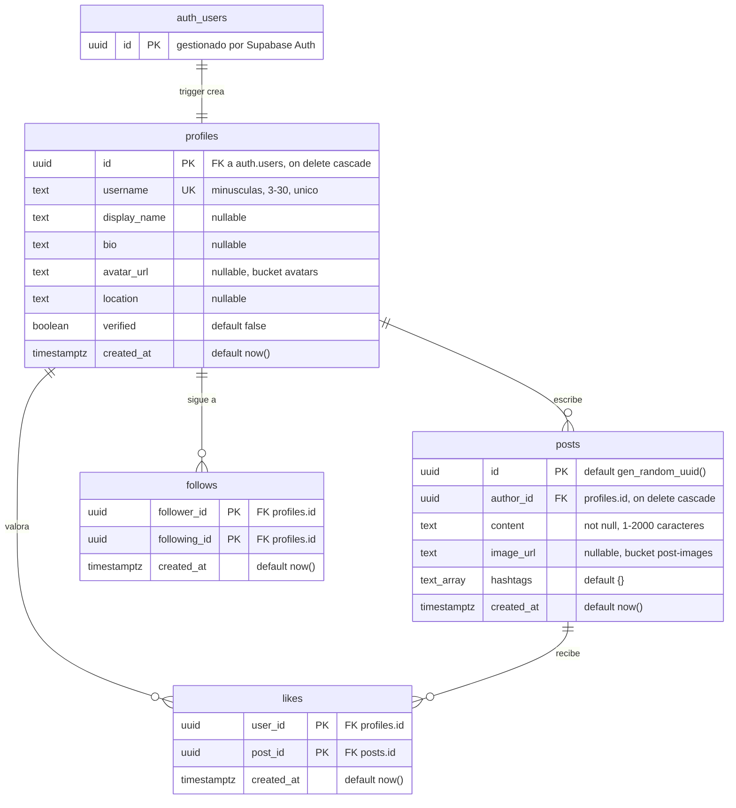
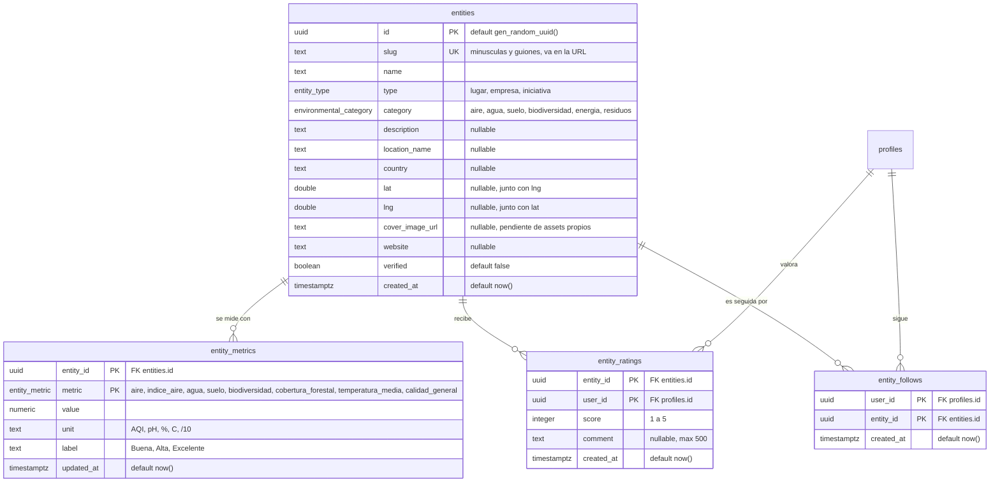

# 03 — Modelo de datos

Esquema de Supabase para el MVP: cuentas, publicaciones, seguimientos y
valoraciones. Definido en `supabase/migrations/`, tipado en
`src/lib/database.types.ts`.

**Principio que gobierna todo lo que sigue:** la autorización vive en la base de
datos, no en la app. El cliente lleva la clave anónima, que es pública; lo que
impide que alguien escriba en nombre de otro es RLS. Toda tabla nace con RLS
activado y sus políticas en la misma migración.

## Diagrama


```mermaid
erDiagram
    auth_users ||--|| profiles : "trigger crea"
    profiles   ||--o{ posts    : escribe
    profiles   ||--o{ follows  : "sigue a"
    profiles   ||--o{ likes    : valora
    posts      ||--o{ likes    : "recibe"

    auth_users {
        uuid id PK "gestionado por Supabase Auth"
    }

    profiles {
        uuid id PK "FK a auth.users, on delete cascade"
        text username UK "minusculas, 3-30, unico"
        text display_name "nullable"
        text bio "nullable"
        text avatar_url "nullable, bucket avatars"
        text location "nullable"
        boolean verified "default false"
        timestamptz created_at "default now()"
    }

    posts {
        uuid id PK "default gen_random_uuid()"
        uuid author_id FK "profiles.id, on delete cascade"
        text content "not null, 1-2000 caracteres"
        text image_url "nullable, bucket post-images"
        text_array hashtags "default {}"
        timestamptz created_at "default now()"
    }

    follows {
        uuid follower_id PK "FK profiles.id"
        uuid following_id PK "FK profiles.id"
        timestamptz created_at "default now()"
    }

    likes {
        uuid user_id PK "FK profiles.id"
        uuid post_id PK "FK posts.id"
        timestamptz created_at "default now()"
    }
```

### Entidades ambientales (F2.1)

Lugares, empresas e iniciativas. Es contenido **curado**: se carga con un seed y
no se escribe desde la app.


```mermaid
erDiagram
    entities       ||--o{ entity_metrics : "se mide con"
    entities       ||--o{ entity_ratings : "recibe"
    profiles       ||--o{ entity_ratings : "valora"
    entities       ||--o{ entity_follows : "es seguida por"
    profiles       ||--o{ entity_follows : "sigue"

    entities {
        uuid id PK "default gen_random_uuid()"
        text slug UK "minusculas y guiones, va en la URL"
        text name
        entity_type type "lugar, empresa, iniciativa"
        environmental_category category "aire, agua, suelo, biodiversidad, energia, residuos"
        text description "nullable"
        text location_name "nullable"
        text country "nullable"
        double lat "nullable, junto con lng"
        double lng "nullable, junto con lat"
        text cover_image_url "nullable, pendiente de assets propios"
        text website "nullable"
        boolean verified "default false"
        timestamptz created_at "default now()"
    }

    entity_metrics {
        uuid entity_id PK "FK entities.id"
        entity_metric metric PK "aire, indice_aire, agua, suelo, biodiversidad, cobertura_forestal, temperatura_media, calidad_general"
        numeric value
        text unit "AQI, pH, %, C, /10"
        text label "Buena, Alta, Excelente"
        timestamptz updated_at "default now()"
    }

    entity_ratings {
        uuid entity_id PK "FK entities.id"
        uuid user_id PK "FK profiles.id"
        integer score "1 a 5"
        text comment "nullable, max 500"
        timestamptz created_at "default now()"
    }

    entity_follows {
        uuid user_id PK "FK profiles.id"
        uuid entity_id PK "FK entities.id"
        timestamptz created_at "default now()"
    }
```

`auth_users` es `auth.users`, el esquema que gestiona Supabase Auth: se dibuja
para entender de dónde sale un perfil, pero no se toca desde la app.

## Tablas

### profiles

Un perfil por cuenta. No se crea desde la app: lo crea el trigger al registrarse
(ver más abajo).

| Columna        | Tipo          | Notas |
| -------------- | ------------- | ----- |
| `id`           | `uuid` PK     | FK a `auth.users(id)`, `on delete cascade`: al borrar la cuenta desaparece todo lo suyo. |
| `username`     | `text` único  | Minúsculas, dígitos y `_`, de 3 a 30 caracteres (`profiles_username_format`). Va en URLs y menciones. |
| `display_name` | `text`        | Nombre visible. Nullable: el username hace de respaldo. |
| `bio`          | `text`        | Descripción libre. |
| `avatar_url`   | `text`        | URL pública en el bucket `avatars`. |
| `location`     | `text`        | Texto libre. El mapa (F2.3) sitúa **entidades**, que sí tienen `lat`/`lng`; las personas no tienen coordenadas. |
| `verified`     | `boolean`     | Cuenta verificada (empresas e iniciativas). |
| `created_at`   | `timestamptz` | |

**Ojo: `verified` lo puede cambiar su dueño.** La política de update solo
comprueba que seas tú, así que hoy podrías marcarte como verificado desde la
app. Está anotado como limitación abajo: la verificación real necesita una
columna protegida o una función aparte, y eso es trabajo de cuando exista el
flujo de verificación.

### posts

| Columna      | Tipo          | Notas |
| ------------ | ------------- | ----- |
| `id`         | `uuid` PK     | `gen_random_uuid()`. |
| `author_id`  | `uuid` FK     | `profiles.id`, `on delete cascade`. |
| `content`    | `text`        | No vacío y máximo 2000 caracteres. |
| `image_url`  | `text`        | URL pública en `post-images`. |
| `hashtags`   | `text[]`      | Default `{}`, nunca null: así el código no distingue entre "sin etiquetas" y "null". |
| `created_at` | `timestamptz` | |

Índices:

| Índice | Para qué |
| ------ | -------- |
| `posts_created_at_idx (created_at desc)` | Feed cronológico y descubrimiento. |
| `posts_author_created_at_idx (author_id, created_at desc)` | Publicaciones de un perfil y feed de cuentas seguidas: filtra y ordena en el mismo índice. |
| `posts_hashtags_idx` (GIN) | Búsqueda por etiqueta en la sección Buscar. |

### follows

Tabla de relación pura: `(follower_id, following_id)` es la clave primaria, así
que no se puede seguir dos veces a la misma cuenta. Un `check` impide seguirse a
uno mismo.

La PK ya sirve para "a quién sigo"; `follows_following_id_idx` cubre la pregunta
inversa, "quién me sigue".

### likes

Igual que `follows`: PK compuesta `(user_id, post_id)`, que hace imposible
valorar dos veces. `likes_post_id_idx` sirve para contar y listar las
valoraciones de una publicación.

### entities

| Columna | Tipo | Notas |
| ------- | ---- | ----- |
| `slug` | `text` único | Minúsculas, dígitos y guiones, 3–60 caracteres. Va en la URL y es la clave del seed: repetirlo actualiza en vez de duplicar. |
| `type` | `entity_type` | `lugar`, `empresa` o `iniciativa`. |
| `category` | `environmental_category` | Ver el enumerado abajo. |
| `lat` / `lng` | `double precision` | `entities_coords_together` obliga a que estén las dos o ninguna: media posición no sirve para poner un punto en un mapa. |
| `cover_image_url` | `text` | Nula por ahora — ver limitaciones. |
| `verified` | `boolean` | Entidad comprobada. Al ser contenido curado, aquí sí es fiable. |

### entity_metrics

Una fila por entidad y métrica; la clave primaria compuesta hace que la última
medición sustituya a la anterior. `label` guarda la lectura en palabras
("Buena", "Alta") en vez de calcularla, porque cada métrica tiene su escala: 42
es bueno en AQI y sería absurdo en pH.

**Solo las llevan los lugares.** Medir la calidad del aire de un parque o un río
tiene sentido; de una ONG, no. Empresas e iniciativas se juzgan por
`entity_ratings`, que es lo que enseñan los mockups en Buscar.

### entity_ratings

La valoración comunitaria de la visión: lo que dice una empresa de sí misma pesa
menos que lo que dice quien vive al lado. Una valoración por persona y entidad
(clave primaria compuesta), puntuación de 1 a 5 y comentario opcional.

`entity_rating_summary` es una vista que devuelve media y número por entidad.

**La app escribe con `upsert` sobre la clave primaria**, así que valorar dos
veces sustituye en vez de duplicar — es lo que la tabla ya impone. Y limita el
comentario a **300** caracteres, por debajo de los 500 del `check`: el tope de
la interfaz es una decisión de producto y tiene que caber siempre dentro de la
restricción, no al revés.

### entity_follows

Quién sigue a qué entidad (F2.2, migración `004`). Es el equivalente de
`follows` para entidades.

| Columna | Tipo | Notas |
| ------- | ---- | ----- |
| `user_id` | `uuid` | FK a `profiles.id`, `on delete cascade`. Parte de la PK. |
| `entity_id` | `uuid` | FK a `entities.id`, `on delete cascade`. Parte de la PK. |
| `created_at` | `timestamptz` | `default now()`. |

**Va en su propia tabla y no en `follows`**, que referencia `profiles` por los
dos lados: meter aquí una entidad obligaría a una columna nula y a un check de
"o una u otra", justo la deuda que F1.3 evitó al separar personas de entidades.

La PK compuesta impide seguir dos veces a la misma entidad. Índice extra en
`entity_id`, que es por donde se pregunta "cuántos siguen a esta".
Existe porque ese dato aparece en la ficha de Buscar, en la tarjeta del mapa y
en el perfil ambiental, y conviene que los tres lo calculen igual. Lleva
`security_invoker = on`, así que respeta las políticas de quien consulta y no
las de quien la creó. **Las entidades sin valorar no aparecen en la vista**: la
ausencia se trata como "sin valoraciones".

### entity_admins (F4.4, migración `005`)

Quién administra la **página** de una entidad: el modelo LinkedIn adaptado,
donde solo hay cuentas de personas y las entidades las gestionan personas.

| Columna | Tipo | Notas |
| ------- | ---- | ----- |
| `entity_id` | `uuid` | FK a `entities`, `on delete cascade`. Parte de la PK. |
| `user_id` | `uuid` | FK a `profiles`, `on delete cascade`. Parte de la PK. |
| `role` | `text` | `admin` por defecto; el `check` admite también `super_admin` y `content_admin`, para cuando haya roles. |
| `status` | `text` | `approved` por defecto; el `check` admite `pending` y `revoked`, para cuando haya revisión. |
| `created_at` | `timestamptz` | |

**La aprobación es automática por ahora**, y la política de INSERT lo impone:
solo deja crear la fila en nombre propio y con `role = 'admin'` y `status =
'approved'`. Así nadie puede darse un rol mayor ni saltarse una revisión
futura escribiendo el campo. Sin política de UPDATE: hoy nadie cambia un rol.
Índice extra en `user_id` para "qué páginas administro".

### jobs (F4.4, migración `006`)

Ofertas de empleo de una página. Enumerado `job_type`: `completa`, `parcial`,
`voluntariado`, `practicas`.

| Columna | Tipo | Notas |
| ------- | ---- | ----- |
| `entity_id` | `uuid` | La página que la publica. |
| `created_by` | `uuid` nullable | Quién la publicó. **Nulo = oferta de ejemplo** cargada por el seed. |
| `title` / `description` | `text` | 3–120 y 1–4000 caracteres. |
| `location_name` | `text` | Nullable. |
| `type` | `job_type` | |
| `how_to_apply` | `text` | Email o URL; la app lo valida. |
| `active` | `boolean` | `true` por defecto. Cerrar una oferta es ponerla a `false`. |

Lectura: las activas, cualquiera; las inactivas, solo quien las creó.
Escritura (INSERT, UPDATE, DELETE): en nombre propio **y** siendo
administrador aprobado de esa entidad, con una subconsulta a `entity_admins`.
Por eso las ofertas de ejemplo (`created_by` nulo) no las puede tocar nadie
desde la app: son contenido curado.

### posts.entity_id (F4.4, migración `007`)

Lugar de Turismo Verde etiquetado en una publicación. Nullable, `on delete set
null` (si el lugar se borra, la publicación se queda sin etiqueta) e índice
parcial `(entity_id, created_at desc) where entity_id is not null`. Que sea un
lugar lo comprueba la app: un `check` necesitaría una subconsulta. RLS de
`posts` sin cambios.

### Mensajes 1 a 1 (F4.6, migración `008`)

Lo **único privado** del producto: todo lo demás se lee sin cuenta, una
conversación solo la leen las dos personas que hablan.

| Tabla | Qué guarda |
| ----- | ---------- |
| `blocks` | `(blocker_id, blocked_id)`, PK compuesta y `check` contra bloquearse a uno mismo. Solo la ve quien bloquea: el bloqueado no sabe quién le bloqueó. |
| `conversations` | Una por pareja: `user_low < user_high` con `unique`, así que entre dos personas hay **una** conversación, la empiece quien la empiece. `requested_by`, `status` (`pending` → `accepted` / `declined`) y `last_message_at`, que mueve un trigger. |
| `messages` | `conversation_id`, `sender_id`, `body` (1–2000 tras quitar espacios), `created_at` y `read_at`, que marca el destinatario. |

**`public.is_blocked_between(a, b)`** dice si hay un bloqueo en cualquier
sentido. Es `security definer` porque las políticas de mensajes necesitan
saberlo aunque quien escribe sea el bloqueado, que no puede leer `blocks`; y
solo responde si quien pregunta es `a` o `b`, así que no sirve para averiguar
bloqueos ajenos.

**Columnas que la app puede cambiar:** en `conversations`, solo `status`; en
`messages`, solo `read_at`. Va con `grant update (columna)` además de la
política: la política dice **quién**, el permiso de columna dice **qué**. Así
nadie mueve la pareja, cambia quién pidió la conversación ni reescribe un
mensaje enviado.

**`touch_conversation`** (trigger `after insert` en `messages`, `security
definer`) sube `last_message_at`: lo hace la base para que nadie necesite
permiso sobre esa columna.

**Tiempo real.** `messages` y `conversations` entran en la publicación
`supabase_realtime`. Realtime aplica la RLS de quien escucha: un mensaje solo le
llega a quien puede leerlo.

**Sin DELETE** en conversaciones ni mensajes, todavía. Denunciar y moderar son
obligatorios antes de abrir al público general (@docs/plan.md).

## Políticas RLS

Dos patrones. En las diez tablas públicas, **cualquiera lee**; lo que escribe la
gente solo lo escribe su propietario, y el contenido curado (`entities`,
`entity_metrics`) no lo escribe nadie desde la app. En las tres del chat
(`blocks`, `conversations`, `messages`) **solo leen las personas implicadas**, y
ningún anónimo lee nada.

| Tabla      | SELECT            | INSERT                       | UPDATE                       | DELETE                       |
| ---------- | ----------------- | ---------------------------- | ---------------------------- | ---------------------------- |
| `profiles` | público (`true`)  | `auth.uid() = id`            | `auth.uid() = id`            | `auth.uid() = id`            |
| `posts`    | público (`true`)  | `auth.uid() = author_id`     | `auth.uid() = author_id`     | `auth.uid() = author_id`     |
| `follows`  | público (`true`)  | `auth.uid() = follower_id`   | — sin política               | `auth.uid() = follower_id`   |
| `likes`    | público (`true`)  | `auth.uid() = user_id`       | — sin política               | `auth.uid() = user_id`       |
| `entities` | público (`true`)  | — **ninguna**                | — **ninguna**                | — **ninguna**                |
| `entity_metrics` | público (`true`) | — **ninguna**          | — **ninguna**                | — **ninguna**                |
| `entity_ratings` | público (`true`) | `auth.uid() = user_id` | `auth.uid() = user_id`       | `auth.uid() = user_id`       |
| `entity_follows` | público (`true`) | `auth.uid() = user_id` | — sin política               | `auth.uid() = user_id`       |
| `entity_admins` | público (`true`) | propio, `role = admin`, `status = approved` | — sin política | `auth.uid() = user_id` |
| `jobs` | activas, o propias | propio **y** admin aprobado de la entidad | ídem | ídem |
| `blocks` | solo quien bloquea | `auth.uid() = blocker_id` | — sin política | `auth.uid() = blocker_id` |
| `conversations` | las dos personas | quien pide, siendo parte, `pending` y sin bloqueo | solo el destinatario, a `accepted`/`declined`; solo `status` | — sin política |
| `messages` | las dos personas | propio, en conversación aceptada (o pendiente si la pediste) y sin bloqueo | solo el destinatario; solo `read_at` | — sin política |

`entities` y `entity_metrics` **no tienen ninguna política de escritura**, y es
deliberado: son contenido curado. RLS deniega por defecto, así que ni un
anónimo ni una cuenta con sesión pueden tocarlas. El seed escribe con
`service_role`, que salta RLS y no sale nunca del entorno de quien lo ejecuta.

En `follows` y `likes` **no hay política de UPDATE a propósito**: esas filas no
tienen nada que actualizar — se crean o se borran. Sin política, RLS deniega, que
es exactamente el comportamiento correcto.

El SELECT es público de verdad (rol `anon` incluido): la web es visitable sin
cuenta. Que todo perfil y publicación sea legible por cualquiera es una decisión
de producto, no un descuido — no hay contenido privado en el MVP.

Las condiciones se escriben `(select auth.uid())` en vez de `auth.uid()` a
secas. Envuelto en un `select`, Postgres lo evalúa una vez por consulta en lugar
de una vez por fila; en un feed con paginación la diferencia se nota.

## Trigger: crear el perfil al registrarse

`public.handle_new_user()` se dispara `after insert on auth.users` y crea la
fila de `profiles`:

- El `username` sale de `raw_user_meta_data->>'username'` (lo que la app manda
  en el registro), en minúsculas. Si no viene, se genera `user_<8 hex del id>`.
- `display_name` sale de `raw_user_meta_data->>'display_name'`, o queda null.

Es `security definer` porque en ese instante todavía no hay sesión y RLS
bloquearía el insert. Lleva `set search_path = ''` —práctica recomendada de
Supabase contra el secuestro de `search_path`—, y por eso dentro de la función
todo va con el esquema explícito.

**Si el username ya existe o no cumple el formato, el registro entero falla.** Es
deliberado: es mejor que la app pida otro username a que la cuenta quede creada
con un nombre que el usuario no eligió. La pantalla de registro (F1.1) traduce
ese error a un mensaje sobre el username.

## Storage

| Bucket        | Público | Tamaño máx. | Tipos                      |
| ------------- | ------- | ----------- | -------------------------- |
| `avatars`     | sí      | 2 MB        | JPEG, PNG, WebP            |
| `post-images` | sí      | 10 MB       | JPEG, PNG, WebP            |

Los límites se aplican en el servidor: un cliente manipulado no puede saltárselos.

Los dos están en uso: `avatars` desde F1.3 (la app reduce a 512 px antes de
subir, `src/lib/avatars.ts`) y `post-images` desde F1.4 (1600 px,
`src/lib/posts.ts`). La mecánica común vive en `src/lib/images.ts`.

**Convención de rutas: `{uid}/{archivo}`.** La primera carpeta del objeto es el
id del usuario, y de ahí salen las políticas de escritura:

```
avatars/3f9c1e2a-…/perfil.jpg
post-images/3f9c1e2a-…/2026-09-18-ribera.jpg
```

Lectura pública en ambos buckets; insert, update y delete solo si
`(storage.foldername(name))[1] = auth.uid()::text`, es decir, solo dentro de tu
propia carpeta.

## Enumerados de dominio

### Categorías ambientales

`aire`, `agua`, `suelo`, `biodiversidad`, `energia`, `residuos`. Definidas en
`src/theme/categories.ts` junto con su color y el color de texto que contrasta
sobre él.

**No son un campo de `posts`, y es deliberado.** Una publicación se clasifica
por sus `hashtags`: libres, en las palabras de quien escribe. El enumerado de
categorías es para las **entidades** y las **capas del mapa**, donde una
clasificación cerrada sí tiene sentido porque alimenta filtros y leyendas.

Desde F2.1 existe como enumerado de Postgres, `environmental_category`, con
**seis valores**: `aire`, `agua`, `suelo`, `biodiversidad`, `energia`,
`residuos`. Salen de unir las capas de los dos mockups, que no coincidían — el
primero muestra biodiversidad y el segundo la cambia por energía y residuos. El
color de cada una vive en `src/theme/categories.ts`, con el razonamiento y las
medidas de contraste; una guarda de tipos en `src/lib/entities.ts` hace que la
compilación falle si el enumerado de la base y el del theme dejan de coincidir.

### Métricas de una entidad

`entity_metric`, ocho valores: `aire`, `indice_aire`, `agua`, `suelo`,
`biodiversidad`, `cobertura_forestal`, `temperatura_media` y `calidad_general`.
Es un enumerado y no texto libre para que la app pueda dar a cada métrica su
icono, su formato y su orden sin adivinar.

**`aire` e `indice_aire` no son la misma métrica en otra unidad**, y conviene
saberlo antes de pintarlas. El mockup 2 enseña las dos a la vez en la ficha del
Río Ntem: un AQI crudo de 42 en "Datos clave" y un subíndice normalizado de
8.9 sobre 10 en la fila de índices. **Un AQI baja cuando el aire mejora y un
índice sube**, así que no hay conversión posible entre ellas; y tampoco caben en
la misma fila, porque la clave primaria de `entity_metrics` es
`(entity_id, metric)`.

**`suelo` y `biodiversidad` se quedan con su nombre, aunque guarden un índice
sobre 10.** Era una incoherencia anotada en F2.1 y F2.4 la resolvió sin
migración: la métrica dice **de qué capa** es el dato y `unit` dice **en qué
escala** está. La fila "Estado por capa" del perfil ambiental
(`src/lib/metrics.ts`, `groupMetrics`) enseña la unidad siempre, así que un
8,5 /10 y un 8,2 pH no se leen como comparables. El aire es el único caso con
dos métricas porque es el único con dos mediciones distintas de la misma capa
en la misma entidad: ahí `indice_aire` ocupa la fila y el AQI baja a "Datos
clave". Si mañana una entidad trae un suelo crudo **y** un índice de suelo, se
añade `indice_suelo` como se hizo con el aire.

### Etiquetas (`hashtags`)

Se extraen del propio texto al publicar (`src/lib/hashtags.ts`) y se guardan
normalizadas: en minúsculas, sin `#`, sin repetir y **conservando las tildes**.
`#Reforestación` se guarda como `reforestación`. Máximo 10 por publicación.

### Tipo de cuenta

**No existe: es deliberado.** `profiles` modela **personas**. Empresas e
iniciativas son entidades distintas —con campos, ciclo de vida y permisos
propios— y desde F2.1 tienen su propia tabla, `entities`, con contenido de
ejemplo cargado. `verified` sigue sirviendo para marcar cuentas comprobadas.

La decisión y su razonamiento están en el
[archivo de notas, F1.3](notas-archivo-f0-f2.md#2026-09-18--f13-perfiles-completos-y-seguimiento).

## Migraciones

Viven en `supabase/migrations/`:

| Archivo | Qué hace |
| ------- | -------- |
| `001_initial_schema.sql` | Tablas, índices, RLS, políticas y el trigger de registro. |
| `002_storage.sql` | Buckets y políticas de `storage.objects`. |
| `003_entities.sql` | Entidades ambientales, sus métricas, las valoraciones y la vista de resumen. |
| `004_entity_follows.sql` | Seguir entidades: `entity_follows`, con su índice y sus políticas. |
| `005_entity_admins.sql` | Administradores de páginas: `entity_admins` y sus políticas (F4.4). |
| `006_jobs.sql` | Ofertas de empleo: enumerado `job_type`, `jobs` y sus políticas (F4.4). |
| `007_post_entities.sql` | Lugar etiquetado en una publicación: `posts.entity_id` e índice (F4.4). |
| `008_messages.sql` | Mensajes 1 a 1: `blocks`, `conversations`, `messages`, la función `is_blocked_between`, el trigger `touch_conversation` y la publicación de Realtime (F4.6). |

Cada una va envuelta en `begin; … commit;`: si algo falla a mitad, no queda nada
aplicado a medias.

### Cómo aplicarlas

**Recomendado: SQL Editor del dashboard.** Con el proyecto ya creado es el camino
con menos fricción — no hay que instalar el CLI, ni enlazar el proyecto, ni tener
a mano la contraseña de la base de datos.

**Van en orden y una por query.** Cada archivo es una transacción completa: o
entra entero o no entra nada, así que un fallo a mitad no deja el esquema a
medias, pero tampoco aplica la mitad buena.

1. Supabase → **SQL Editor** → *New query*.
2. Pegar el contenido íntegro de `supabase/migrations/001_initial_schema.sql`.
3. *Run*. Debe terminar con `Success. No rows returned`.
4. Repetir con `002_storage.sql` en una query nueva.
5. Repetir con `003_entities.sql` en otra query nueva.
6. Repetir con `004_entity_follows.sql` en otra query nueva.
7. Repetir con `005_entity_admins.sql`.
8. Repetir con `006_jobs.sql` —**después** de `005`: sus políticas consultan
   `entity_admins`—.
9. Repetir con `007_post_entities.sql`.
10. Repetir con `008_messages.sql`. Su última línea añade `messages` y
    `conversations` a la publicación `supabase_realtime`; para comprobarlo,
    **Database → Publications → supabase_realtime** debe listar las dos (o
    ver el paso 10 de la verificación).

Si el paso 4 devuelve un error de permisos al crear políticas sobre
`storage.objects`, crear las mismas reglas desde **Storage → Policies** en el
dashboard.

**Ninguna es re-ejecutable.** Usan `create table` y `create type` a secas, sin
`if not exists`: lanzarlas dos veces da `already exists` y la transacción se
deshace sola. Eso es deliberado — un `create ... if not exists` sobre un esquema
que ya cambió pasa en silencio y deja la base diciendo una cosa y el repositorio
otra. Si hay que rehacer una, se borra antes lo que creó.

> **Sobre el CLI:** `supabase db push` espera nombres con marca de tiempo
> (`20260918120000_initial_schema.sql`) y **rechaza** los prefijos `001_` /
> `002_`. Si más adelante quieres llevar las migraciones con el CLI, hay que
> renombrar los archivos a ese formato y hacer `supabase link` primero.

### Después de aplicar

**1. Cargar el contenido curado de las entidades.** `003` crea las tablas
vacías; los catorce lugares, empresas e iniciativas los mete el seed. Escribe
con `service_role` porque `entities` y `entity_metrics` **no tienen ninguna
política de escritura** (ver más arriba), así que la clave se pasa solo en el
momento de ejecutar y nunca se guarda en un fichero:

```bash
SUPABASE_SERVICE_ROLE_KEY='...' npm run seed:entities -- --dry-run   # solo enumera
SUPABASE_SERVICE_ROLE_KEY='...' npm run seed:entities                # escribe
```

> **Cuidado con `--dry-run`:** imprime el listado completo y termina con
> "Simulacro: no se ha escrito nada". Es fácil leerlo como un éxito. Si
> `verify:f21` dice que `entities` está vacía, es que solo se pasó el simulacro.

Los dos seeds comprueban **antes de escribir** que la clave es de verdad de
servicio —la secreta, `sb_secret_…`, o la `service_role` antigua— y paran si
reciben la publicable o la anónima. Con la clave equivocada cada fila llegaría
como anónima y RLS la rechazaría con un error que despista (pasó en F4.4).

Es idempotente por `slug`: repetirlo actualiza en vez de duplicar. **Desde
F4.4 hay que repetirlo una vez**: las descripciones de los cinco lugares están
reescritas para quien los visita.

**2. Cargar las ofertas de empleo de ejemplo** (tras `006`). Mismo patrón y
misma clave:

```bash
SUPABASE_SERVICE_ROLE_KEY='...' npm run seed:jobs -- --dry-run   # solo enumera
SUPABASE_SERVICE_ROLE_KEY='...' npm run seed:jobs                # escribe
```

Ocho ofertas repartidas entre EcoGuinea, GreenTech, Bosques Vivos, Bosques
para el futuro, Río limpio, Solaris, Aire Puro y Reforestación urbana Málaga,
de los cuatro tipos. Van con `created_by` nulo, que la app enseña como
**"Oferta de ejemplo"** y en las que no ofrece aplicar; sus direcciones usan
el dominio reservado `.example`. Idempotente por entidad y título.

**3. Regenerar los tipos**, que son la otra mitad del contrato:

```bash
npx supabase login
npx supabase gen types typescript \
  --project-id <PROJECT_REF> --schema public > src/lib/database.types.ts
npm run typecheck
```

Los tipos del repositorio ya incluyen lo de `003`, así que aquí regenerar sirve
de comprobación: si el `git diff` sale vacío, la base y el código dicen lo
mismo.

## Cómo verificar que funciona

**Lo rápido, desde la terminal.** Dos scripts cubren casi todo esto sin tocar el
dashboard, y son los que hay que creer porque usan la clave anónima, la misma
que la app:

```bash
npm run verify:auth   # 001 y 002: tablas, RLS en ambos sentidos, trigger, buckets
npm run verify:f21    # 003: tablas, seed, coordenadas, métricas y RLS de entidades
npm run verify:f44    # 005-007: claims, ofertas y su RLS, lugares etiquetados
```

Lo de abajo es la comprobación a mano, en el **SQL Editor**, para cuando algo
falla y hay que ver por qué.

### 1. RLS activado en las trece tablas

```sql
select relname as tabla, relrowsecurity as rls_activado
from pg_class
where relnamespace = 'public'::regnamespace and relkind = 'r'
order by relname;
```

Las trece deben dar `true`: `profiles`, `posts`, `follows`, `likes`, `entities`,
`entity_metrics`, `entity_ratings`, `entity_follows`, `entity_admins`, `jobs`,
`blocks`, `conversations` y `messages`. Una sola en `false` es una tabla
abierta a internet — y en las tres del chat, conversaciones privadas a la vista
de cualquiera.

`entity_rating_summary` no sale en esta consulta porque es una vista, no una
tabla. La suya se comprueba en el punto 8.

### 2. Las políticas están donde deben

```sql
select tablename, policyname, cmd, roles
from pg_policies
where schemaname = 'public'
order by tablename, cmd;
```

Esperado, 39 en total:

| Tabla | Políticas | |
| ----- | --------- | - |
| `profiles` | 4 | |
| `posts` | 4 | |
| `follows` | 3 | sin UPDATE, como se explicó arriba |
| `likes` | 3 | sin UPDATE |
| `entities` | 1 | solo SELECT: contenido curado, nadie lo escribe |
| `entity_metrics` | 1 | solo SELECT |
| `entity_ratings` | 4 | esto sí lo escribe la gente |
| `entity_follows` | 3 | sin UPDATE: una fila de seguimiento no se actualiza |
| `entity_admins` | 3 | sin UPDATE: hoy nadie cambia un rol |
| `jobs` | 4 | escribir, solo administradores aprobados de la entidad |
| `blocks` | 3 | sin UPDATE |
| `conversations` | 3 | sin DELETE |
| `messages` | 3 | sin DELETE |

### 3. El trigger crea el perfil

Dashboard → **Authentication → Users → Add user**, con email y contraseña.
Después:

```sql
select p.id, p.username, p.display_name, p.created_at
from public.profiles p
order by p.created_at desc
limit 5;
```

Debe aparecer una fila nueva con un username `user_xxxxxxxx`. Si la creación del
usuario falla con un error de base de datos, el trigger está roto: mirar
**Logs → Postgres**.

Guarda ese `id`, hace falta en el paso siguiente.

### 4. RLS: lectura pública

```sql
begin;
  set local role anon;
  select count(*) from public.profiles;
  select count(*) from public.posts;
rollback;
```

Debe responder sin error: un visitante sin cuenta puede leer.

### 5. RLS: no puedes escribir en nombre de otro

Sustituye `<TU_UUID>` por el id del paso 3 y `<OTRO_UUID>` por cualquier otro
uuid distinto.

```sql
-- Debe FALLAR: "new row violates row-level security policy for table posts"
begin;
  set local request.jwt.claims = '{"sub":"<OTRO_UUID>"}';
  set local role authenticated;
  insert into public.posts (author_id, content)
  values ('<TU_UUID>', 'suplantando a otra cuenta');
rollback;
```

```sql
-- Debe FUNCIONAR: escribes en tu propio nombre
begin;
  set local request.jwt.claims = '{"sub":"<TU_UUID>"}';
  set local role authenticated;
  insert into public.posts (author_id, content)
  values ('<TU_UUID>', 'publicación de prueba');
  select id, content from public.posts where author_id = '<TU_UUID>';
rollback;
```

El `rollback` deja la base de datos como estaba: son pruebas, no datos.

Si el primer bloque **no** falla, RLS no está protegiendo nada — no sigas a F1
hasta arreglarlo.

### 6. Las restricciones de integridad

```sql
-- Debe FALLAR por el check follows_no_self_follow
begin;
  insert into public.follows (follower_id, following_id)
  values ('<TU_UUID>', '<TU_UUID>');
rollback;
```

### 7. Storage

```sql
select id, public, file_size_limit, allowed_mime_types from storage.buckets;

select policyname, cmd
from pg_policies
where schemaname = 'storage' and tablename = 'objects'
order by policyname;
```

Dos buckets y ocho políticas (cuatro por bucket). Prueba práctica: sube un
archivo desde **Storage → avatars** a una carpeta con el nombre de tu uuid y
comprueba que la URL pública lo sirve.

### 8. Entidades ambientales (migración 003)

**El seed ha entrado, y con el reparto que toca:**

```sql
select type, count(*) from public.entities group by type order by type;
```

Esperado: 5 `lugar`, 5 `empresa`, 4 `iniciativa`. Catorce en total. Si sale
vacío, la migración está pero el seed no — ver "Después de aplicar".

**Las métricas son las de los mockups, exactamente.** Estos números se enseñan
como datos reales, así que ni faltan ni sobran:

```sql
select e.slug, m.metric, m.value, m.unit, m.label
from public.entity_metrics m
join public.entities e on e.id = m.entity_id
where e.slug in ('parque-nacional-monte-alen', 'rio-ntem')
order by e.slug, m.metric;
```

Monte Alén tiene **cuatro** (aire 42 AQI, agua 8.2 pH, biodiversidad 8.7/10,
cobertura forestal 78 %) y ninguna más: no lleva calidad general. El Ntem tiene
**siete**, y entre ellas el aire dos veces — `aire` con el AQI crudo de 42 e
`indice_aire` con el subíndice de 8.9/10, que son cosas distintas y no
convertibles. `indice_aire` va con `label` nulo a propósito.

**Nadie puede escribir el contenido curado.** Ni un anónimo ni una cuenta con
sesión: la tabla tiene RLS y **ninguna** política de escritura, así que la
denegación es por defecto.

```sql
-- Debe FALLAR las dos veces
begin;
  set local role anon;
  insert into public.entities (slug, name, type, category)
  values ('intruso', 'Intruso', 'lugar', 'aire');
rollback;

begin;
  set local request.jwt.claims = '{"sub":"<TU_UUID>"}';
  set local role authenticated;
  insert into public.entities (slug, name, type, category)
  values ('intruso', 'Intruso', 'lugar', 'aire');
rollback;
```

Si alguno de los dos **funciona**, alguien le ha añadido una política a
`entities` y el contenido ha dejado de ser curado.

**Las valoraciones sí son de la gente**, con las tres reglas de siempre: solo en
nombre propio, una por entidad y puntuación de 1 a 5.

```sql
-- Debe FALLAR por el check de rango
begin;
  set local request.jwt.claims = '{"sub":"<TU_UUID>"}';
  set local role authenticated;
  insert into public.entity_ratings (entity_id, user_id, score)
  select id, '<TU_UUID>', 9 from public.entities limit 1;
rollback;
```

**La vista de resumen respeta las políticas de quien consulta**, porque se creó
con `security_invoker = on`:

```sql
select c.relname, c.reloptions
from pg_class c
where c.relnamespace = 'public'::regnamespace and c.relname = 'entity_rating_summary';
```

`reloptions` debe contener `security_invoker=on`. Aquí da igual porque las
valoraciones son públicas, pero una vista que ignora RLS es una fuga esperando a
que alguien la reutilice con una tabla que sí importe.

### 9. Seguir entidades (migración 004)

**Una persona puede seguir, y solo en su nombre.**

```sql
-- Debe FUNCIONAR
begin;
  set local request.jwt.claims = '{"sub":"<TU_UUID>"}';
  set local role authenticated;
  insert into public.entity_follows (user_id, entity_id)
  select '<TU_UUID>', id from public.entities limit 1;
rollback;
```

```sql
-- Debe FALLAR: no se sigue en nombre de otra cuenta
begin;
  set local request.jwt.claims = '{"sub":"<TU_UUID>"}';
  set local role authenticated;
  insert into public.entity_follows (user_id, entity_id)
  select '<OTRO_UUID>', id from public.entities limit 1;
rollback;
```

```sql
-- Debe FALLAR por la clave primaria compuesta: no se sigue dos veces
begin;
  set local request.jwt.claims = '{"sub":"<TU_UUID>"}';
  set local role authenticated;
  insert into public.entity_follows (user_id, entity_id)
  select '<TU_UUID>', id from public.entities limit 1;
  insert into public.entity_follows (user_id, entity_id)
  select '<TU_UUID>', id from public.entities limit 1;
rollback;
```

Un anónimo no puede insertar en ningún caso: la política de INSERT es solo para
`authenticated`.

### 10. Mensajes (migración 008)

**Lo rápido:** `npm run verify:f46` lo comprueba todo con tres cuentas de prueba
—dos que se escriben y una tercera que no debe ver nada— y las borra al acabar.

A mano, que Realtime emite las dos tablas:

```sql
select tablename from pg_publication_tables
where pubname = 'supabase_realtime' and schemaname = 'public'
order by tablename;
```

Deben salir `conversations` y `messages`. Si faltan, los mensajes se guardan
pero no llegan solos: hay que recargar para verlos.

Y que un anónimo no lee nada:

```sql
begin;
  set local role anon;
  select count(*) from public.messages;       -- 0
  select count(*) from public.conversations;  -- 0
rollback;
```

## Limitaciones conocidas

Ninguna bloquea la demo. Las tachadas están resueltas y se conservan por el
razonamiento; las demás siguen abiertas en el backlog de @docs/plan.md.

1. ~~**No hay `account_type` en `profiles`.**~~ **Resuelto en F1.3, y no con una
   columna:** `profiles` representa **personas** y nada más. Empresas e
   iniciativas son entidades propias, con su tabla desde F2.1. Ver la decisión
   en el [archivo de notas, F1.3](notas-archivo-f0-f2.md#2026-09-18--f13-perfiles-completos-y-seguimiento).
2. ~~**No hay `category` en `posts`.**~~ **Resuelto en F1.4, y tampoco con una
   columna:** la clasificación temática de una publicación son sus `hashtags`,
   libres y escritos por quien publica. Las categorías ambientales
   estructuradas pertenecen a las entidades y a las capas del mapa, no al
   contenido social. Ver la decisión en el
   [archivo de notas, F1.4](notas-archivo-f0-f2.md#2026-09-18--f14-composición-de-publicaciones).
3. **`verified` es escribible por su dueño.** Cualquiera puede marcarse como
   cuenta verificada editando su perfil desde la app. Hace falta sacarla de la
   política de update —con un trigger que impida cambiarla, o moviéndola a otra
   tabla— cuando exista el flujo de verificación.
4. ~~**`likes` no es la valoración comunitaria.**~~ **Resuelto en F2.1/F2.4:**
   `likes` sigue siendo el "me gusta" de una publicación, y la valoración de la
   visión es `entity_ratings` —de 1 a 5 con comentario, una por persona y
   entidad— con su media en `entity_rating_summary`. Se valora desde el perfil
   ambiental de la entidad.
5. **`location` de `profiles` sigue siendo texto libre.** `entities` sí tiene
   `lat`/`lng`; para consultas por área con volumen haría falta PostGIS, pero
   con un índice normal basta para la demo.
6. **Las entidades no tienen imagen.** `cover_image_url` es nulo en todo el
   seed: no se enlazan fotos de terceros y todavía no hay imágenes propias. La
   portada del perfil ambiental es un degradado del color de la categoría con
   su icono (F2.4).
7. **El seed no trae valoraciones.** `entity_ratings` referencia a `profiles`,
   así que una valoración necesita una persona real detrás. Por eso las fichas
   dicen "Nuevo" o "Sé el primero en valorar" en vez de un 0,0.
