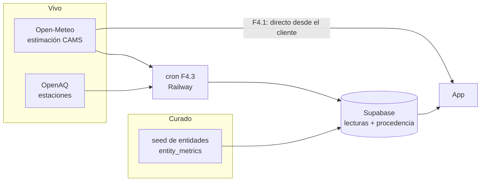

# 08 — Datos en vivo (F4)

Cómo pasa OVENG de catorce entidades con datos curados a **dato ambiental vivo
de cualquier punto del mundo, con su procedencia a la vista**. Es la etapa F4
de @docs/plan.md.

---

## Objetivo

Que cualquier persona, en cualquier sitio, abra OVENG y vea **cómo está el aire
donde está ahora**, sabiendo de dónde sale ese dato. Es la pieza de *utilidad
individual* de @docs/07_CRECIMIENTO.md llevada a su consecuencia: hoy el mapa
sirve a quien vive cerca de una de las catorce entidades; con dato vivo sirve a
cualquiera.

**Va después de F3.** Las conversaciones de validación pueden cambiar su
tamaño —hacerla más grande si el mapa resulta ser el producto, o más pequeña si
no—, y construirla antes sería justificar lo ya hecho. **Excepción: F4.1** puede
adelantarse a F3, porque enseñar el aire real de la casa de quien escucha, en
vez de un dato de ejemplo, cambia la conversación. Es una sesión, no una fase.

---

## Lo que hay hoy y por qué no basta

Las 25 métricas de `entity_metrics` son **contenido curado**: las mete el seed y
salen de los mockups de diseño (ver @docs/03_MODELO_DATOS.md). Están bien para
una demo, pero tienen tres límites:

- **No se mueven.** Un `updated_at` del día del seed, para siempre.
- **No hay histórico**: un valor por métrica y entidad, así que la gráfica de
  evolución del mockup 1 no tiene de dónde salir.
- **Solo hay dato donde hay entidad**: cinco lugares de Guinea Ecuatorial y
  ninguno en Málaga.

Y una cuarta que esta etapa obliga a mirar de frente: si la procedencia se
enseña, **el dato curado también tiene que decir de dónde sale**. Hoy esos
números vienen de un diseño, no de una medición.

---

## Fuentes

| Fuente | Qué da | Cobertura | Acceso | Papel |
| ------ | ------ | --------- | ------ | ----- |
| **Open-Meteo Air Quality** | PM2.5, PM10, NO₂, O₃, SO₂, CO, US AQI y AQI europeo, por horas y con previsión | **Cualquier coordenada** | Gratis, **sin clave**, con CORS | **Base mundial** |
| **OpenAQ** (API v3) | Mediciones de estaciones reales, oficiales y de bajo coste | Donde haya estación | Clave gratuita | **Preferente donde haya estación cerca** |
| **GBIF** | Observaciones de especies con coordenadas | Mundial, desigual | Público, sin clave | **A evaluar** para biodiversidad |

### Open-Meteo: la base mundial

Sirve el modelo **CAMS de Copernicus**: no es una medición, es una **estimación
de modelo** a partir de satélite y meteorología, en una rejilla de unas decenas
de kilómetros. Es justo lo que permite responder en cualquier coordenada.

Comprobado el 2026-10-04 contra Bata (1,86 N · 9,77 E): responde sin clave y
devuelve el punto de rejilla más cercano (1,90 · 9,80) con US AQI 22, AQI
europeo 16 y PM2.5 de 3 µg/m³.

**A cerrar antes de usarlo en serio:** el uso gratuito es **no comercial** y con
límite de llamadas diarias, y los datos piden atribución. Hay que revisar las
condiciones vigentes antes de cualquier uso comercial, y el cron de F4.3 sirve
también para no gastar una llamada por visita.

### OpenAQ: estaciones de verdad

Una estación mide; un modelo estima. Donde haya una estación cerca, su dato
gana. La API v3 **exige clave** (sin ella responde 401, comprobado), y la clave
**no puede ir en el bundle** —sería pública—, así que OpenAQ entra con el
servidor de F4.3, no antes.

**Cobertura en Guinea Ecuatorial: por medir.** Lo probable es que no haya
ninguna estación y que allí todo sea Open-Meteo; en Málaga y Andalucía sí hay
red oficial. Se mide al empezar F4.2, no se supone.

### GBIF: biodiversidad, a evaluar

Comprobado: **162.964 observaciones** con país Guinea Ecuatorial, 28.545 desde
2020 con coordenadas. Hay materia. Lo que no está claro es **qué indicador**
honesto sale de ahí: un recuento de observaciones mide cuánta gente ha mirado,
no cuánta vida hay, y convertirlo en un "8,7 de biodiversidad" sería inventar
una escala. Cada conjunto de datos lleva su propia licencia, así que la
atribución va por conjunto. Se evalúa en F4.2; puede acabar siendo "especies
observadas cerca" sin nota.

---

## Arquitectura híbrida

Dos tipos de dato conviven, y la app nunca los confunde:

- **F4.1, sin servidor.** El cliente pide a Open-Meteo la coordenada que toca.
  Sin clave, sin migración, sin despliegue nuevo: por eso cabe en una sesión.
- **F4.3, con servidor.** Un cron en **Railway** consulta las fuentes por
  horas, guarda cada lectura en Supabase con su procedencia y deja la app
  leyendo de su propia base. Tres cosas que el cliente solo no puede:
  esconder la clave de OpenAQ, **acumular histórico** —que es lo que desbloquea
  la gráfica de evolución— y no depender del límite de llamadas por visita.
- El curado **no desaparece**: sigue siendo lo que se sabe de una entidad
  concreta, con su procedencia propia.

### Procedencia en el modelo

Toda lectura guarda, además del valor, **de dónde sale y cómo se obtuvo**:

| Campo | Ejemplo |
| ----- | ------- |
| fuente | `openaq`, `open-meteo`, `curado` |
| método | `estacion`, `modelo`, `manual` |
| origen concreto | nombre de la estación, o "CAMS global" |
| instante de la medición | no el de la consulta |
| distancia | de la estación o del punto de rejilla al lugar pedido |

Es una migración y la aplica una persona a mano; se diseña en F4.2, no en F4.1.

---

## Procedencia siempre visible

**La honestidad de procedencia es un rasgo de marca**, no una nota al pie. Cada
dato lleva una línea pequeña que dice qué es:

- 📡 **Estación** *(nombre de la estación)* · hace 1 h
- 🛰️ **Estimación satelital** Copernicus (CAMS) · hace 2 h
- 📋 **Dato curado** · ficha de la entidad, sin actualización automática

Siempre, en la tarjeta de zona, en el mapa, en el perfil ambiental y en lo que
se comparte. Una estimación no se disfraza de medición, ni un dato de hace tres
días de dato de ahora.

Es la misma línea que ya se siguió sin tener dato vivo: la tarjeta de zona dice
**qué lugar** mide el aire (F2.5), F2.1 quitó del seed un número sin fuente, y
F2.4 no dibujó una gráfica sin histórico. Esta etapa le pone nombre.

---

## Principios de interfaz

- **Semáforo y palabra primero, AQI después, µg/m³ solo en detalle.** Lo
  primero que se ve es "Buena" sobre verde. El número del índice va al lado, y
  los contaminantes en microgramos solo al abrir el detalle. Quien quiere saber
  si sale a correr no necesita saber qué es el PM2.5.
- **Cada dato navega a algo.** Un índice lleva a su detalle, una estación a su
  ubicación en el mapa, una zona a sus entidades. Un número que no lleva a
  ninguna parte se lee como decoración.
- **Tu zona frente a la media, como mecánica compartible.** "El aire en tu zona
  está mejor que el 80 % de la región hoy" es una frase que se reenvía; un
  "AQI 22" no. Es la materia de las tarjetas de F4.5.
- **Una escala de índice, y la misma en todas partes.** Open-Meteo da US AQI y
  europeo, con tramos distintos. El 42 "Bueno" de los mockups encaja con la
  escala estadounidense (0–50 es "bueno"). **Decisión pendiente para F4.1**:
  elegir una y no mezclarlas nunca en la misma pantalla.

---

## Convivencia de lo vivo y lo curado

Una entidad puede tener las dos cosas: una medición curada en su ficha y una
lectura viva en su coordenada. **Las dos se enseñan, cada una con su
procedencia**, y la más reciente no borra a la otra. Si dicen cosas distintas,
eso es información, no un error que esconder.

Los valores curados de los mockups merecen su propia etiqueta mientras sigan
ahí. Si la app enseña al lado un dato real, el curado no puede seguir
pareciendo una medición.

---

## Fases

| Fase | Qué | Tamaño |
| ---- | --- | ------ |
| **F4.1** pieza mínima | Open-Meteo en la tarjeta de zona del feed y en el mapa, para el centro de la zona y para cada lugar, con la línea de procedencia. Sin servidor ni migración. Decide la escala de AQI. | ~1 sesión |
| **F4.2** procedencia completa + OpenAQ | Modelo de lecturas con procedencia (migración), OpenAQ donde haya estación cerca, etiqueta del dato curado y evaluación de GBIF. | Fase |
| **F4.3** cron en Railway | Lecturas horarias guardadas en Supabase: histórico, clave de OpenAQ fuera del cliente y sin depender del límite por visita. Desbloquea la gráfica de evolución. | Fase |
| **F4.4** geolocalización opcional | "Tu zona" detectada si se concede el permiso, elegida si no. Trae el caso "me han dicho que no" y la imprecisión en escritorio. | Fase |
| **F4.5** compartir con marca | Tarjetas, marca de agua y OG tags, con el dato y su procedencia dentro. Descrita en @docs/07_CRECIMIENTO.md. | Fase |

Lo que queda abierto en @docs/01_ARQUITECTURA.md —capas de datos sobre el
territorio y fuente de los datos ambientales— se resuelve aquí: la fuente es
Open-Meteo con OpenAQ encima, y las capas de superficie siguen siendo una
pregunta aparte, porque una rejilla de decenas de kilómetros pintada como
mancha de color promete una precisión que no tiene.
